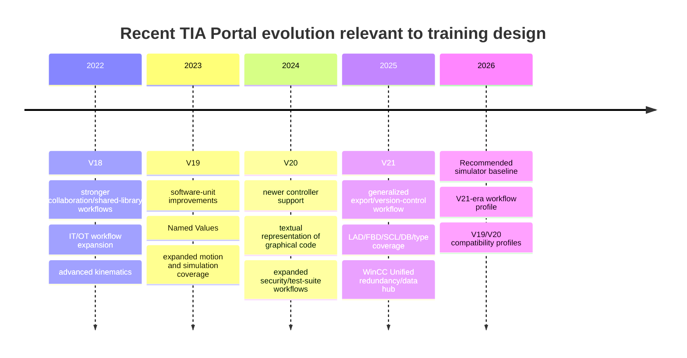
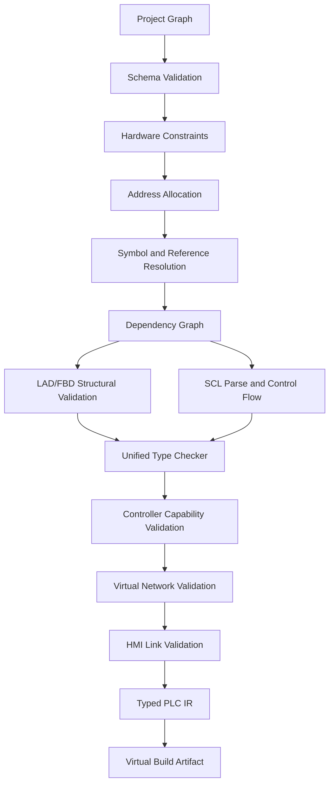
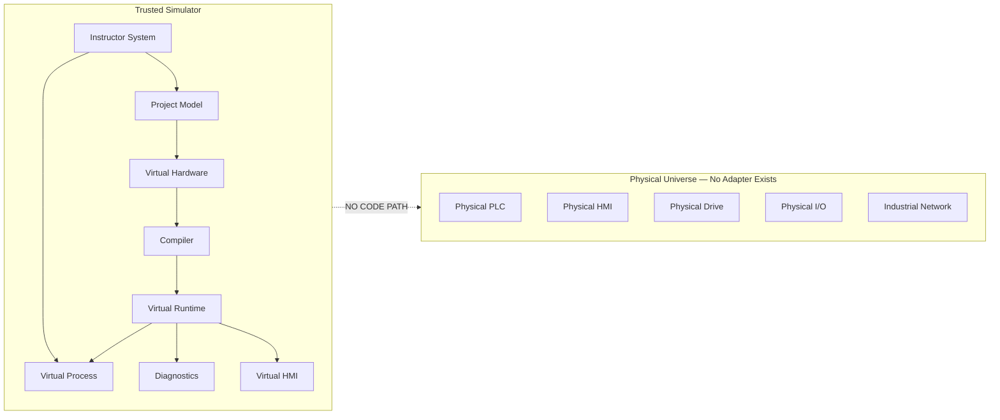
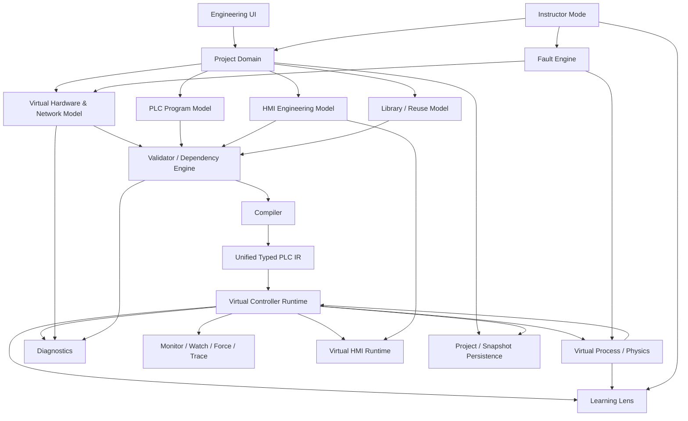

# Clean-Room High-Fidelity PLC Engineering Simulator: Authoritative Research-to-Build Specification

## Executive Summary

**Research posture.** This specification is based on lawfully accessible public material, with Siemens documentation and product material used as the primary source for TIA Portal, STEP 7, PLCSIM, WinCC, S7-1200/S7-1500-class engineering, libraries, team engineering, diagnostics, PID and motion behavior; IEC material is used for vendor-neutral PLC-language concepts; U.S. Copyright Office, USPTO, Siemens public terms, and appellate/Supreme Court materials are used for the legal-risk track. This is **risk analysis, not a legal opinion or guarantee of legality**.

For traceability, statements are labeled throughout as follows:

| Label | Meaning |
|---|---|
| **DOCUMENTED** | Behavior or fact supported by a cited authoritative source. |
| **INFERENCE** | Reasonable conclusion drawn from documented material, but not expressly stated by the source. |
| **PROPOSED** | Behavior this simulator should implement; not a claim that Siemens implements it identically. |
| **LEGAL INTERPRETATION** | Preliminary IP/legal risk analysis, not legal advice. |
| **ENGINEERING RECOMMENDATION** | Architecture, product, testing, or implementation judgment. |

### Bottom-line product definition

**ENGINEERING RECOMMENDATION.** Build a **professional PLC engineering and automation simulation environment for education**, not a Siemens emulator and not industrial-control software.

It should let a student perform a recognizable modern PLC engineering lifecycle:

> Create project → configure fictional virtual controller and I/O → create tags and data types → build OB/FB/FC/DB program structure → program in LAD/FBD/SCL → compile → resolve genuine inconsistencies → perform a fictional virtual commissioning/download workflow → run a deterministic virtual PLC → monitor logic → use watch/force/trace tools → troubleshoot virtual hardware/process/network faults → engineer a virtual HMI → diagnose the whole virtual system.

TIA Portal's real product model integrates hardware configuration, controller programming, simulation/testing, visualization and commissioning into a common engineering framework, so reproducing those *relationships and workflow stages* is much more important for training transfer than reproducing Siemens' colors, icons or pixel layout. Siemens continues to describe current TIA Portal in precisely this integrated-lifecycle role. citeturn10search1turn11search2

The previous research draft already converged on the correct core principle—**causal fidelity rather than screenshot fidelity, with an internal virtual universe rather than physical-device connectivity**—and this specification turns that principle into enforceable repository and acceptance requirements. fileciteturn0file0

### Recommended reference release

**DOCUMENTED.** As of August 27, 2026, **TIA Portal V21 is the current major release**. Siemens introduced V21 in November 2025. Among other changes, V21 added a new export representation supporting version-control workflows for LAD, FBD, SCL, DBs, PLC data types and mixed-language blocks; WinCC Unified V21 also added redundant-server and centralized archive capabilities. citeturn11search2

**DOCUMENTED.** V20, released in November 2024, added support for newer controller generations, human-readable representations of graphical code for external engineering/version-control workflows, security/user-management improvements, and expanded Test Suite functions including regression, test-driven and sequential testing. citeturn11search4turn11search9 V19 emphasized motion control, software units, Named Values and broader PLCSIM Advanced coverage, while V18 had expanded collaborative engineering, shared libraries, IT/OT-oriented workflows and complex kinematics. citeturn10search5turn10search4

**ENGINEERING RECOMMENDATION.** Use a **V21-era workflow profile as the principal reference**, while architecting the simulator around a version-neutral semantic core with selectable `TrainingProfile` capability manifests. V19 and V20 should be the first compatibility profiles because many school laboratories will remain one or two releases behind the current software.

Do **not** name the fictional controller profiles after Siemens hardware. The active simulator catalog should instead expose objects such as:

| Simulator identity | Training purpose |
|---|---|
| Compact Controller | compact PLC workflow |
| Modular Controller | rack/module PLC workflow |
| Performance Controller | larger memory/instruction/interrupt profile |
| Technology Controller | motion-oriented coursework |
| Distributed I/O Station | remote-I/O concepts |
| Basic Operator Panel | introductory HMI |
| Advanced Operator Panel | richer HMI |
| Variable-Speed Drive | generic drive concepts |
| Servo Drive | generic axis/motion concepts |

Siemens names such as TIA Portal, S7-1200, S7-1500 and WinCC should appear only in **research provenance, compatibility explanations and legally reviewed factual documentation**, never as the application's own branding or as the identity of its simulated equipment. Siemens' own trademark guidance warns against third-party uses that imply affiliation, endorsement, sponsorship or support, while USPTO guidance centers trademark confusion analysis on whether related goods or services may be perceived as originating from the same source. citeturn16search1turn16search0turn16search3

### Non-negotiable simulation wall

The controlling architectural invariant is:

> **`VirtualUniverse` has no adapter to `PhysicalUniverse`.**

Not a disabled adapter.

Not a driver hidden behind a feature flag.

Not an interface implemented only by a simulator today.

**No abstraction for physical industrial communication should exist.**

The runtime must not contain or expose:

- S7/S7comm/S7comm-plus;
- PROFINET DCP or PROFINET I/O;
- PROFIBUS;
- EtherNet/IP/CIP;
- Modbus TCP/RTU;
- external OPC UA;
- physical PLC/HMI/drive discovery;
- TIA Openness integration;
- Siemens engineering DLLs;
- Siemens PLCSIM APIs;
- raw Ethernet;
- TCP/UDP socket APIs;
- serial-device APIs;
- USB-device APIs;
- Bluetooth-device APIs;
- WebSerial;
- WebUSB;
- WebBluetooth;
- WebRTC;
- WebSocket;
- `fetch`;
- `XMLHttpRequest`;
- external HTTP clients;
- native FFI capable of loading industrial communication libraries;
- child-process execution capable of invoking industrial tools.

Those prohibitions apply especially to the **compiler, controller runtime, virtual commissioning system, process simulator, HMI runtime and Instructor Mode**.

A virtual IP address is only a validated string/value inside a graph.

A virtual scan for accessible devices searches an in-memory `VirtualNetwork`.

A virtual download transfers an internal build artifact to a `VirtualControllerId`.

A virtual HMI connection subscribes to an internal typed tag bus.

No stage maps those concepts to the host operating system.

### Three product modes

**PROPOSED.**

**Engineering Mode** should behave like serious engineering software. It should minimize training wheels and emphasize normal workflow, contextual editors, compile results, commissioning states, monitoring and diagnostics.

**Learning Lens** should be an optional explanatory overlay exposing things that genuine engineering software normally leaves implicit: scan-cycle steps, input/output images, rung reasoning, data flow, timer internals, memory state, type propagation and causal diagnostic explanations.

**Instructor Mode** must be a first-class subsystem, not a collection of tutorial pop-ups. It should provide lesson construction, checkpoints, hidden faults, state-based grading, scenario reset, controlled hints, replay, student audit logs and fault injection. Crucially, Instructor Mode **changes simulation state; it never directly manufactures the expected compiler or diagnostic message.**

For example:

```text
Instructor injects "Motor overload"
              ↓
Virtual motor enters FAULTED_OVERLOAD state
              ↓
Virtual overload contact changes
              ↓
Virtual input image changes
              ↓
PLC logic executes normally
              ↓
Motor command may drop / alarm logic may execute
              ↓
Diagnostics/HMI/process visualization react from real state
```

That same causal rule governs deliberately broken code. A lesson asking the student to diagnose a missing tag should delete or break the underlying symbol reference; the ordinary compiler must discover it.

### Explicit assumptions

| Unspecified issue | Controlling assumption |
|---|---|
| Target OS | No OS constraint; design the trusted domain/runtime as platform-neutral and offline-first. |
| Framework | No imposed framework; recommend TypeScript/React UI and a deterministic Rust/WASM semantic/runtime core. |
| TIA reference version | V21-era workflow is the primary training profile. |
| Back-version support | V19 and V20 profiles are first secondary targets. |
| Controller identity | Fictional generic devices only; no on-brand virtual PLCs. |
| HMI reference | Modern WinCC Unified-era concepts receive priority, with selected classic-panel conventions where coursework requires them. |
| Networking | Fictional graph only; physical industrial networking is permanently excluded. |
| Project format | Original simulator format only. |
| Real TIA project import/export | Excluded unless separately researched and legally approved. |
| Safety | Educational concepts may be inventoried; no safety-rated engineering or certification claims. |
| Jurisdiction | Legal discussion is primarily U.S.-focused; international distribution requires jurisdiction-specific advice. |
| Classroom deployment | Offline/local use must work without internet access. |
| Standards | IEC 61131-3 concepts are the vendor-neutral language foundation; Siemens-specific behavior is layered as documented compatibility behavior. |
| Pixel fidelity | Explicitly not a goal. |
| Training-transfer fidelity | Primary acceptance target. |

**DOCUMENTED.** The current IEC 61131-3:2025 edition specifies ST, LD and FBD as its principal programming-language suite and SFC elements for program organization. The previous 2013 edition additionally documented IL and introduced features including references, namespaces and object-oriented extensions. citeturn17search0turn17search1 This supports separating an IEC-style semantic core from Siemens-specific editor and controller capability profiles.

## Product Workflow, Version Baseline, and Complete Feature Taxonomy

### Product/workflow map

**DOCUMENTED.** TIA Portal distinguishes a task-oriented Portal view from the object-oriented Project view. The Project view contains project-tree navigation, a work/editor area, inspector/context information, task cards, editor navigation, status information and related workspace elements. Siemens also supports floating/re-embedded editor elements, saved layouts, search, keyboard navigation and contextual operations. citeturn3search2turn3search14turn3search20turn3search8

**PROPOSED.** Preserve the cognitive pattern but replace Siemens-specific presentation:

| TIA concept | Original simulator presentation |
|---|---|
| Portal/start view | **Home Workspace** |
| Project view | **Engineering Workspace** |
| Project tree | **Project Navigator** |
| Work area | **Editor Workspace** |
| Inspector | **Context & Properties** |
| Task cards | **Tool Palette** |
| Hardware catalog | **Virtual Device Catalog** |
| Messages pane | **Build & Diagnostics** |
| Online/diagnostics view | **Virtual Controller Session** |
| Watch/force tables | **Monitor & Force Workspace** |
| PLCSIM workspace | **Simulation Console** |
| HMI runtime | **Virtual Operator Runtime** |

A normal student workflow should look like this:

```mermaid
flowchart LR
    A[Create/Open Project] --> B[Add Fictional Controller]
    B --> C[Configure Virtual Hardware]
    C --> D[Configure Virtual Network]
    D --> E[Create Tags and Data Types]
    E --> F[Create OB/FB/FC/DB Structure]
    F --> G[Program LAD/FBD/SCL]
    G --> H[Compile and Validate]
    H -->|Errors| I[Diagnose and Repair]
    I --> H
    H -->|Build valid| J[Start Virtual Controller]
    J --> K[Virtual Load Preview]
    K --> L[Virtual Download]
    L --> M[RUN]
    M --> N[Monitor / Watch / Force / Trace]
    N --> O[Virtual Process and HMI]
    O --> P[Fault Injection / Diagnostics]
    P --> N
```



**DOCUMENTED.** Genuine STEP 7 compilation and loading are separate phases: offline software is compiled before use, Load Preview evaluates conditions and required actions, and some changes require a CPU STOP before loading can proceed. citeturn2search10turn2search11turn2search12

### Version comparison



| Release | Documented shifts | Simulator consequence |
|---|---|---|
| **V18** | Siemens emphasized multiuser collaboration, shared libraries, Simatic AX/IT-oriented workflows, advanced 5D/6D kinematics and R1 redundancy. citeturn10search4 | Treat collaboration, sophisticated motion and redundancy as capability/profile features rather than timeless core behavior. |
| **V19** | Siemens highlighted software units, Named Values, improved modularization/versioning and broader hardware/software-controller simulation with PLCSIM Advanced. citeturn10search5 | Add software units/namespaces and named values to P2; V19 is a worthwhile laboratory compatibility profile. |
| **V20** | Added newer controllers, readable text representation of graphical code for external tooling, UMAC/security changes and Test Suite improvements including regression/TDD/sequential testing. citeturn11search4turn11search9 | Keep source representation, security and automated testing modular. |
| **V21** | New export/version-control representation covers LAD, FBD, SCL, DBs, PLC data types and mixed-language blocks; WinCC Unified adds server redundancy/central archive features. citeturn11search2 | Use V21-era terminology/workflow as primary research baseline but implement an original project/source format. |

**DOCUMENTED.** TIA Portal V21 can directly upgrade V14 through V20 projects after confirmation; projects older than V14 require an intermediate older TIA version. Once saved as V21, the project is not backward-compatible with older TIA releases. citeturn21search0turn21search1

**PROPOSED.** Simulator migration should intentionally mimic the *concept* rather than the file compatibility:

```text
Simulator schema 1
      ↓ migration report
Simulator schema 2
      ↓
Training Profile V19 / V20 / V21-era
```

Profile changes should be allowed to create legitimate warnings such as “instruction unavailable under selected controller profile” or “project object requires a newer training capability,” but simulator project files must never be `.apXX`, `.zapXX` or loadable TIA artifacts.

### Project lifecycle

**DOCUMENTED.** TIA V21 supports project creation/opening, recent projects, project metadata, compatibility/upgrading and project archiving. Its archive command operates on the last saved state and can create a compressed `.zap21` archive. citeturn20search0turn21search1

**PROPOSED P0/P1 project behavior**

```text
Project
├── Metadata
├── Devices
├── Networks
├── PLC software
│   ├── Program blocks
│   ├── Tags
│   ├── Data types
│   ├── Watch/force tables
│   ├── Traces
│   └── Technology objects
├── HMI
├── Reusable library
├── Process model
├── Instructor scenarios
├── Diagnostics/build history
└── Virtual controller snapshots
```

Required lifecycle operations:

- New, Open, Close, Save and Save As;
- recent projects;
- metadata, description and training profile;
- copy/paste;
- rename;
- move/group/folder;
- delete;
- transactional undo/redo;
- project-wide search;
- editor find/replace;
- simulator-native archive/retrieve;
- autosave journal;
- crash recovery;
- schema migration;
- integrity/checksum checking;
- read-only reference project;
- compare against another simulator project;
- simulator-native structured import/export where educationally useful.

**PROPOSED identity invariant:** every semantically referenceable object receives an immutable UUID.

Therefore:

```text
Rename tag → UUID unchanged → references remain valid.

Delete tag → UUID tombstoned → references become unresolved.

Undo delete → original UUID restored → references resolve again.

Copy tag → new UUID → independent object.
```

This single choice underpins authentic navigation, compile dependency, undo, library and HMI behavior.

### Libraries and reusable engineering

**DOCUMENTED.** Modern TIA has project and global libraries, master copies, versioned library types and project instances. A type from a global library becomes represented in the project library and project instances link to the project-library copy. TIA's APIs also expose type versions, master copies, instance updating, comparison and synchronization. citeturn19search13turn19search10

**PROPOSED P1 reuse model**

Two deliberately distinct concepts:

**Template Copy**

```text
Template
   ↓ instantiate
Independent object
```

**Versioned Type**

```text
Type v1.0
   ↓ release
Instances
   ↓
Type v1.1 draft
   ↓ validate/release
Instance update analysis
   ↓
compatible auto-update / manual conflict
```

Required states:

`Draft → Validating → Released → Superseded`.

Required errors:

- type contains unresolved dependency;
- release attempted with compiler errors;
- type update invalidates instance;
- deleted referenced type;
- circular library dependency;
- target controller profile lacks capability;
- update conflict.

Do not implement Siemens library file formats.

### Team engineering

**DOCUMENTED.** TIA V21 Multiuser Engineering uses server projects and local sessions, supports parallel editing/check-in concepts, selection/marking of objects and conflict states, and can continue working in a local session when the project-server connection is unavailable, subject to restrictions. citeturn19search2turn19search7turn19search8

**PROPOSED P3.** Simulate team engineering **locally**, without creating a real collaborative server:

```text
Baseline
  ├── Student A local change-set
  └── Student B simulated change-set
            ↓
      Conflict analyzer
            ↓
      resolve / accept / overwrite
```

This teaches change ownership, stale objects, conflicts and check-in concepts without violating the no-network architecture.

### Hardware configuration

**DOCUMENTED.** TIA's Devices & Networks environment contains device, network and topology perspectives; device configuration and network/topology state are distinct views of the automation configuration. citeturn0search8

**PROPOSED virtual hardware model**

```text
ControllerProfile
├── allowed rack layout
├── slot restrictions
├── supported module families
├── address-space limits
├── supported block/language features
├── runtime memory limits
├── interrupt capabilities
├── technology capabilities
└── restart/retention profile

VirtualRack
└── Slot[]
    └── VirtualModule
        ├── channels
        ├── address span
        ├── parameters
        ├── quality/state
        └── diagnostics
```

P0 catalog:

- compact controller;
- modular controller;
- digital input;
- digital output;
- analog input;
- analog output;
- power-supply placeholder where educationally relevant.

P1:

- mixed I/O;
- distributed I/O station;
- RTD/temperature input;
- high-speed counter;
- encoder abstraction;
- generic communication module that communicates **only with another virtual object**.

P2/P3:

- motion/technology module;
- redundant-controller concepts;
- virtual drive;
- specialized process modules;
- safety concepts only after separate review.

Hardware compiler invariants:

```text
CPU count valid
slot legal
module supported
revision/profile compatible
channel configuration valid
address allocation valid
no prohibited overlap
network assignment valid
required virtual interface present
virtual identity unique
```

### Devices and virtual networks

**PROPOSED.** Model three distinct engineering views:

**Device Layout**  
“What is installed where?”

**Logical Network**  
“What virtual interfaces and subnets belong together?”

**Port Topology**  
“What virtual port is notionally cabled to what?”

This distinction is essential because logical assignment and physical topology are different engineering concepts.

A network object:

```text
VirtualInterface {
    id
    ownerDeviceId
    displayName
    virtualAddress?
    subnetMask?
    virtualDeviceName?
    subnetId?
    ports[]
}
```

All values are domain data.

A student's fictional address:

```text
192.168.10.20
```

may be validated against a subnet, compared with another address and displayed in diagnostics, but **must never reach DNS, ARP, ICMP, a socket, host NIC, operating-system route table or external API**.

The virtual accessible-device command is:

```text
VirtualUniverse.queryVisibleDevices(virtualInterfaceId)
```

never:

```text
discoverDevices(hostInterface)
```

### Tags and addressing

**DOCUMENTED.** STEP 7 supports PLC tag tables containing tags and constants, global tag declaration from program editors, address/type/comment editing and monitoring of current online values. Tags may also be declared by dragging them into tag tables. citeturn21search13turn21search17turn21search2

**PROPOSED tag model**

```text
Tag {
    id
    name
    scope
    declaredType
    address?
    comment
    initialValue
    retainPolicy
    hmiVisibility
    constantValue?
}
```

P0 support:

- default tag table;
- additional tables;
- symbolic names;
- `I`, `Q`, `M` conceptual address spaces;
- DB fields;
- bit/byte/word/dword addressing;
- automatic and explicit address assignment;
- comments;
- constants;
- cross references;
- display formats;
- sort/filter;
- bulk edit;
- simulator-native CSV interchange.

Validation:

- illegal identifier;
- duplicate name in same scope;
- prohibited shadowing according to profile;
- malformed address;
- range overflow;
- incompatible address width;
- illegal bit position;
- conflicting explicit allocation;
- data type/address mismatch;
- unknown type;
- deleted referenced tag;
- constant assigned a nonconstant expression where prohibited.

### Program structure

**DOCUMENTED.** STEP 7 program-block organization includes OBs, FBs, FCs and DBs; FB execution uses instance data, and current TIA lets users create global DBs, instance DBs, array DBs and DBs based on PLC data types. citeturn6search3turn6search4turn6search0

P0:

| Object | Simulator semantics |
|---|---|
| OB | Scheduler/runtime entry point |
| FC | Reusable callable code without its own FB-style static instance storage |
| FB | Reusable callable code with static instance state |
| Instance DB | Storage bound to FB instance |
| Global DB | Global structured storage |
| PLC data type / UDT | Reusable named structure |

**DOCUMENTED.** Current block interfaces distinguish formal input/output/in-out data and temporary/local storage depending on block kind; instance FB data is derived from FB interface/static state. citeturn6search13turn6search4

Model:

```text
BlockInterface
├── Input[]
├── Output[]
├── InOut[]
├── Static[]     // only where semantically valid
├── Temp[]
└── Constant[]   // profile-controlled
```

Changing a block signature must propagate through a genuine dependency graph. TIA itself detects call/interface inconsistency and can update dependent calls/DBs during interface update or “rebuild all” operations. citeturn6search1

### OB scheduling

P0:

- startup;
- cyclic main program.

P1:

- cyclic/timed interrupt;
- hardware-event interrupt;
- diagnostic interrupt;
- module pull/plug;
- watchdog/time fault.

P2:

- time-of-day event;
- delayed event;
- richer priority/preemption;
- motion-related execution task.

**DOCUMENTED.** The modern S7 execution model includes diagnostic interrupt processing; for example, a diagnostics-capable module changing diagnostic state can trigger a diagnostic OB with hardware/channel status information. citeturn20search15

Exact OB numbers, priority tables, CPU-specific nesting limits and recursion rules should be capability-profile data rather than universal constants. **NEEDS MORE RESEARCH:** exact V21 controller-family recursion and priority matrices before claiming controller-specific equivalence.

### LAD editor and semantics

**DOCUMENTED.** Siemens LAD represents logic in networks with contacts, branches and boxes and imposes graphical/structural rules; networks execute according to an ordered graphical model, and invalid branch/interconnection structures are constrained by the editor. citeturn5search13turn5search7turn5search0

The LAD model must be semantic first:

```text
Network
└── Series
    ├── Contact(Start)
    ├── NCContact(Stop)
    ├── Parallel
    │   ├── Contact(Auto)
    │   └── Contact(Hold)
    └── Coil(Motor)
```

Screen coordinates are a rendering of that AST/graph, **not the source of program semantics**.

P0 instruction families:

| Family | Required members |
|---|---|
| Bit logic | NO/NC contacts, coils, negation, SET, RESET |
| Edges | positive/rising and negative/falling edge |
| Timers | TON, TOF, TP; retentive timer by profile |
| Counters | CTU, CTD, CTUD |
| Comparison | `=`, `<>`, `<`, `>`, `<=`, `>=`, range/limit |
| Arithmetic | ADD, SUB, MUL, DIV, MOD, ABS, MIN, MAX |
| Transfer | MOVE, block/fill equivalents |
| Conversion | numeric type conversion, rounding, truncation |
| Word logic | AND, OR, XOR, NOT, shifts, rotates |
| Program control | block call, return, jump/label where supported |
| Calls | FC, FB, reusable-library block |
| Utility | CALCULATE-style expression block as P1 |

**DOCUMENTED.** Siemens V21 documents CTUD edge-sensitive up/down behavior and provides math, transfer/conversion and CALCULATE-style instruction families. citeturn22search12turn22search4turn22search15

Structural failures:

- disconnected fragment;
- open branch;
- branch joined illegally;
- invalid output/terminal position;
- incompatible power-flow element;
- instruction lacking operand;
- illegal operand type;
- call with unbound required parameter;
- orphaned call pin;
- unsupported instruction under selected controller profile.

Editing:

- click insertion;
- drag insertion;
- drag operand;
- branch creation/deletion;
- multi-selection;
- rectangle selection;
- cut/copy/paste;
- delete;
- keyboard navigation;
- context menu;
- inline comments;
- network title/comment;
- operand autocomplete;
- quick tag declaration;
- zoom;
- monitoring overlay.

### FBD editor and semantics

**DOCUMENTED.** FBD remains one of the core PLC graphical languages in IEC 61131-3:2025 and is explicitly part of TIA V21's supported modern export/version-control workflow. citeturn17search0turn11search2

**PROPOSED.** FBD should use the same type system and instruction registry as LAD:

```text
SourceTag ──> [ADD] ──> [LIMIT] ──> Destination
Constant  ────┘
```

Internal representation:

```text
TypedPortGraph
    nodes[]
    edges[]
    executionDependencies[]
```

Validation:

- output connected to output;
- multiple writers where prohibited;
- required pin unconnected;
- incompatible types;
- invalid implicit conversion;
- combinational cycle where illegal;
- unresolved block;
- stale block interface;
- unavailable instruction;
- orphan connection.

Monitoring:

- live values at pins;
- live values on connections;
- Boolean state;
- quality/forced status;
- diagnostics navigation.

### SCL / Structured Text

**DOCUMENTED.** Siemens describes SCL as a high-level structured language aligned with IEC 61131-3 concepts and suitable for assignments, expressions, branches, loops and data-oriented algorithms. Modern STEP 7 documentation includes constructs such as `FOR`, `WHILE`, `CONTINUE` and `EXIT`, with type-sensitive relational expressions. citeturn5search6turn5search2turn5search3turn5search8turn5search17

P0 grammar:

```text
declarations
assignments
arithmetic expressions
Boolean expressions
comparisons

IF / ELSIF / ELSE
CASE
FOR
WHILE
REPEAT / UNTIL

function calls
function-block calls
arrays
structure/member access
constants
RETURN
comments
```

P1:

- `EXIT`;
- `CONTINUE`;
- date/time;
- strings;
- named-value constructs;
- advanced arrays;
- selected Siemens-specific conversion/built-in semantics after verification.

Editor:

- syntax highlighting;
- line/column numbers;
- folding;
- auto-indent;
- symbol autocomplete;
- instruction autocomplete;
- signature help;
- diagnostics underlines;
- hover type;
- goto definition;
- find references;
- rename;
- find/replace;
- comment toggle;
- formatting;
- compile markers;
- current-value monitoring.

**LEGAL/ENGINEERING RECOMMENDATION.** Implement IEC ST syntax independently, then add only Siemens-specific lexical/semantic conventions that materially improve training transfer and are documented as functional language behavior. Do not copy Siemens language-service code, completion databases or diagnostic prose.

### Data types and DBs

P0:

```text
BOOL
SINT / INT / DINT / LINT
USINT / UINT / UDINT / ULINT
BYTE / WORD / DWORD / LWORD
REAL / LREAL
CHAR
TIME
STRING
ARRAY
STRUCT
named PLC data type
```

P1/P2:

- WSTRING/wide character;
- date/time-of-day/date-time families;
- long-duration variants;
- references/variant-like values if required by profile;
- named values;
- technology/system data structures.

**DOCUMENTED.** Current STEP 7 supports arrays, structures, strings, named PLC data types, system data types and optimized/standard block-access concepts; optimized access is specifically relevant to modern S7-1200/1500-class devices. citeturn6search14turn6search5

DB value model:

```text
Field
├── declared initial/start value
├── offline project value
├── loaded baseline
├── current virtual actual value
├── retained value
└── quality/force information
```

Students should be able to see the difference between:

- declaration/start value;
- current running value;
- snapshot;
- retained value;
- value after restart;
- value after memory reset.

Do not reproduce proprietary memory layouts for optimized DBs. Teach the addressing/access concept.

### Compiler and validation

This is the highest-priority subsystem after the project model.



Every diagnostic:

```text
Diagnostic {
    code
    severity
    phase
    message
    objectId
    sourceRange?
    relatedObjectIds[]
    recoveryHint?
    buildId
}
```

Use original codes such as:

```text
EDU-TYPE-0014
EDU-HW-0021
EDU-REF-0003
EDU-LAD-0011
```

Do **not** copy Siemens diagnostic numbers or prose.

Compile operations:

- compile current object;
- compile software changes;
- rebuild all software;
- compile virtual hardware;
- compile HMI;
- full project build.

**DOCUMENTED.** TIA's “rebuild all” workflow is significant because interface/type changes can create dependent inconsistencies that are updated or surfaced by recompilation. citeturn6search1

Dependency graph example:

```text
PLC data type MotorData
      ↓
Global DB Motors
      ↓
FB Conveyor
      ↓
OB Main
      ↓
HMI MotorScreen
```

Changing `MotorData` can invalidate all downstream nodes. The compiler—not the UI lesson engine—must determine which objects require rebuild.

### Virtual commissioning/download

**DOCUMENTED.** In STEP 7, Load Preview is a decision stage that can show required actions and whether a change requires CPU STOP before loading; changed dependent blocks may also have to be included to retain consistency. citeturn2search11turn2search12

**PROPOSED virtual workflow**

```text
Select VirtualControllerId
        ↓
Verify virtual instance exists
        ↓
Compile relevant project objects
        ↓
Compare project build fingerprint
with running virtual build
        ↓
Virtual Load Preview
        ↓
Actions:
  STOP required?
  DB initialization?
  memory reset?
  virtual hardware replacement?
        ↓
Student approves/cancels
        ↓
Atomic internal load transaction
        ↓
Load results
        ↓
Optional RUN
```

No interface-selection dialog may list host Ethernet/Wi-Fi adapters.

Instead:

```text
Virtual Engineering Interfaces

Training Adapter A
  Attached to: Cell Network

Training Adapter B
  Attached to: Remote-I/O Network
```

Those are ordinary project objects.

### Online/offline model

```text
OFFLINE
   │ start session
   ▼
CONNECTING_TO_VIRTUAL_OBJECT
   ├──────── failure ──────> VIRTUAL_UNAVAILABLE
   ▼
ONLINE_STOP <──────────────> ONLINE_RUN
     │                           │
     └──── session loss ─────────┘
                 ↓
          VIRTUAL_LINK_LOST
                 │
           restore / close
```

Maintain orthogonal flags:

```text
projectSaved
softwareBuildCurrent
hardwareBuildCurrent
hmiBuildCurrent
virtualControllerLoaded
offlineOnlineMatch
monitoringActive
forceActive
```

**DOCUMENTED.** TIA monitoring requires an online connection and displays current CPU values separately from project/offline data; watch and PLC-tag monitoring can explicitly be started and stopped. citeturn21search2turn21search10

`Go Online` must therefore **not** mean “make project and controller the same.” It opens a session and compares them.

### Virtual PLC runtime

**PROPOSED runtime cycle**

```text
Start scan
   ↓
Process due virtual hardware events
   ↓
Copy virtual physical inputs → input image
   ↓
Dispatch due higher-priority virtual events
   ↓
Execute cyclic OB/program
   ↓
Commit output image → virtual actuator layer
   ↓
Advance deterministic virtual time
   ↓
Update trace / diagnostics / HMI subscriptions
   ↓
End scan
```

Runtime storage:

```text
ProcessInputImage
ProcessOutputImage
MarkerMemory
GlobalDBMemory
InstanceDBMemory
TempFrames
RetainStore
TimerState
CounterState
TechnologyState
DiagnosticBuffer
ForceRegistry
```

CPU states:

```text
POWERED_OFF
STARTUP
RUN
STOP
PAUSED_EDUCATIONAL
FAULTED
RESETTING
```

`PAUSED_EDUCATIONAL` is intentionally an original teaching extension.

Timers must use simulator time—not browser `setTimeout()`—so slow motion, pause, replay and deterministic tests are possible.

### PLCSIM-equivalent simulation console

**DOCUMENTED.** Siemens' current PLCSIM ecosystem supports simulated PLC instances, modification/observation of signals and event APIs. PLCSIM Advanced explicitly models events including diagnostic interrupts, hardware events, pull/plug events and rack/station faults. citeturn22search7 Current Siemens educational material also uses simulated PLC instances, SIM-table-style interaction and sequence/event workflows for training. citeturn7search2

**PROPOSED.**

**Simulation I/O table**

```text
Variable        Address     Type      Process   CPU-visible    Quality
StartPB         I0.0        BOOL      FALSE     FALSE          GOOD
TankLevel       IW64        INT       612       612            GOOD
MotorRun        Q0.0        BOOL      —         TRUE           GOOD
```

**Sequence**

```text
Step      Trigger              Action
Start     t = 0                TankLevel = 15%
Fill      +250 ms              StartPB = TRUE
Release   +100 ms              StartPB = FALSE
High      TankLevel >= 80%     HighSwitch = TRUE
```

**Virtual events**

- channel fault;
- module fault;
- module pulled;
- module restored;
- station unreachable;
- hardware event;
- incoming diagnostic;
- outgoing/cleared diagnostic;
- watchdog;
- simulated power interruption.

### Watch, modify and force

**DOCUMENTED.** STEP 7 distinguishes monitoring/modification and forcing. Watch tables can monitor visible tags with permanent or trigger-specific modes. Force tables can use scan-cycle trigger points, and forcing is persistent enough that simply ending an online connection does not necessarily remove a force. citeturn21search10turn21search11turn1search15

Simulator semantics:

**Watch** = observation.

**Modify** = one-shot write.

**Force** = persistent override owned by `ForceRegistry`.

Example:

```text
Virtual sensor raw state = FALSE
Active force             = TRUE
CPU-visible input         = TRUE
```

A force must remain globally visible even when the table that created it is closed.

Force UI should always show:

- active count;
- forced variable;
- forced value;
- owner/session;
- source table;
- removal action.

Conflicting force requests must fail or require explicit replacement.

### Trace

**DOCUMENTED.** TIA V21 trace can record controller tags based on trigger conditions; documented modes include immediate recording and tag-based triggering with pre-trigger data. Trace is also integrated into controller/motion commissioning. citeturn21search4turn21search9turn21search15

P1 trace:

- multiple Boolean/numeric channels;
- runtime state channels;
- scan-time channel;
- event markers;
- immediate trigger;
- rising/falling trigger;
- threshold;
- expression trigger;
- pre-trigger sample buffer;
- zoom/cursor;
- deterministic export in original simulator CSV/JSON format.

### Diagnostics

**DOCUMENTED.** Siemens exposes CPU diagnostic-buffer and module online status through STEP 7 diagnostic views, and diagnostics-capable hardware can generate diagnostic events. citeturn20search14turn20search15

Simulator diagnostic classes:

```text
Engineering
├── syntax
├── type
├── reference
├── hardware configuration
└── HMI consistency

Virtual CPU
├── startup
├── run/stop
├── watchdog
├── runtime exception
└── reset

Virtual Hardware
├── missing module
├── wrong module
├── channel fault
├── wire break
└── station loss

Virtual Process
├── sensor failure
├── actuator failure
├── overload
└── process constraint violation

Virtual Connection Model
├── logical virtual link unavailable
├── HMI subscription broken
└── distributed station unavailable
```

Event:

```text
DiagnosticEvent {
    id
    code
    severity
    sourceId
    virtualTimestamp
    engineeringTimestamp
    lifecycle: incoming | cleared | oneShot
    title
    detail
    relatedTags[]
    navigationTarget?
}
```

### Cross references and navigation

**DOCUMENTED.** TIA cross references show dependencies/uses and support navigation to the usage location; deleted or unresolved textual references can be represented as invalid references in relevant engineering contexts. citeturn1search7turn1search10

Indexes must support:

- where-used for tag;
- where-used for block;
- callers/callees;
- DB/type usages;
- HMI usages;
- hardware-to-tag mapping;
- unresolved-reference filtering;
- user/system filtering;
- jump to declaration;
- jump to call;
- jump to HMI binding.

### HMI / WinCC engineering

**DOCUMENTED.** WinCC engineering uses internal and external HMI tags, PLC-linked tags, screens and dynamic objects; WinCC Unified supports script-based property dynamization, alarms and trend controls, and its simulation/runtime workflows compile HMI engineering before runtime testing. citeturn8search0turn8search8turn22search0turn22search1turn8search3

P1 HMI:

- virtual HMI device;
- screen tree;
- screen/template concept;
- button;
- text;
- shape;
- lamp;
- I/O field;
- gauge;
- simple graphic;
- navigation;
- internal HMI tag;
- PLC-linked HMI tag;
- visibility animation;
- value/appearance animation;
- press/release/click event;
- alarm view;
- discrete alarm;
- analog threshold alarm;
- alarm classes;
- acknowledgement state;
- trend;
- virtual runtime.

P2:

- recipes/parameter sets;
- user roles;
- authentication simulation;
- historical tags;
- historical alarm log;
- advanced trends;
- reusable original faceplate/component concept;
- constrained scripting.

**DOCUMENTED.** WinCC alarm systems support discrete/analog alarm concepts, classes, acknowledgement/state models and threshold conditions, while trend systems can display values derived from tags or logged data. citeturn9search6turn9search1turn9search5turn22search3

HMI compiler must genuinely detect:

- missing PLC tag;
- incompatible HMI/PLC type;
- deleted screen;
- missing navigation target;
- invalid animation;
- alarm trigger missing;
- trend source missing;
- invalid script syntax;
- recipe member removed;
- duplicate project identifier where required.

HMI runtime uses the internal tag bus only:

```text
VirtualController
      ↓
InternalTagBus
      ↓
VirtualHMI
```

No OPC UA, WebSocket, HTTP or network-backed runtime data link.

### PID, motion, drives and advanced systems

**DOCUMENTED.** TIA V21's PID technology-object model includes PID_Compact with manual/automatic modes and controller tuning/optimization workflow. citeturn20search2turn20search3

**PROPOSED P2 generic PID**

```text
PIDController
├── processValue
├── setpoint
├── output
├── Kp
├── Ti
├── Td
├── limits
├── mode MANUAL/AUTO
└── samplePeriod
```

Implement a conventional independent PID algorithm. Do not reproduce proprietary auto-tuning internals.

**DOCUMENTED.** TIA Motion Control uses technology objects to represent real objects such as axes, supports program instructions for axis control and provides separate commissioning/diagnostic functions. citeturn20search5turn20search4

**PROPOSED P2 axis model**

```text
Axis
├── enabled
├── homed
├── position
├── velocity
├── acceleration
├── limits
├── command state
├── following error
└── fault
```

Commands:

- enable/power;
- home;
- absolute move;
- relative move;
- velocity move;
- halt;
- stop;
- reset.

P3:

- synchronous axes;
- gearing;
- cam;
- multi-axis interpolation;
- generic virtual drives.

**LEGAL REVIEW/P3:** exact trajectory-planning behavior, drive commissioning mimicry, advanced autotuning, complex kinematics and vendor-specific motion interfaces.

### Additional features discovered during omission search

The specification must reserve architecture for the following even where not P0:

- project/global libraries;
- master copies;
- versioned types;
- type-instance migration;
- project/reference-project comparison;
- source representations and version-control workflows;
- software units;
- namespaces;
- Named Values;
- team/multiuser engineering;
- object conflict states;
- test/regression framework;
- trace;
- interrupt OBs;
- runtime analysis;
- system/hardware constants;
- controller-security concepts;
- HMI alarm histories;
- HMI user administration;
- recipes/parameter sets;
- sequential/SFC engineering;
- GRAPH-like workflows;
- legacy STL/AWL awareness;
- CFC-like/add-on engineering concepts;
- technology objects;
- PID;
- axis/motion;
- drives;
- project logs;
- localization/language resources;
- add-ins/automation APIs.

TIA V18–V21's evolution toward collaboration, source-based versioning, software units, tests and advanced motion makes these genuine parts of the broader product map rather than edge curiosities. citeturn10search4turn10search5turn11search4turn11search2

## Failure Modes, UI Fidelity, Teacher System, and Classroom Scenarios

### Failure-mode catalog

**ENGINEERING RECOMMENDATION.** Every failure below must arise from a domain invariant, compiler rule, runtime state, process state or explicit virtual fault—not from a lesson script directly displaying an error.

| Trigger | Internal condition | User-visible behavior | Recovery |
|---|---|---|---|
| Duplicate tag name | Name index collision | Inline validation + build error | Rename |
| Illegal identifier | Identifier lexer rejects | Cell/editor diagnostic | Correct name |
| Unknown type | Type registry miss | Type field error | Select/create type |
| Invalid address | Parser rejects | Address marked invalid | Correct |
| Out-of-range address | Allocation exceeds profile | Hardware/software compile error | Reallocate |
| Overlapping address | Conflicting spans | Collision diagnostic references both objects | Change allocation |
| Wrong data width | Address/type width incompatible | Compile error | Change type/address |
| Deleted tag | Referenced UUID tombstoned | Unresolved operand | Undo/relink/create |
| Rename tag | UUID remains valid | Call sites remain valid | No recovery required |
| Deleted data type | Type target absent | Dependent DB/block errors | Restore/retype |
| Changed UDT member | Structural dependency dirty | Downstream builds invalidated | Update consumers |
| Deleted FC | Call target absent | Call-site error | Restore/rebind |
| Deleted FB | Call/instance dependencies unresolved | Call errors | Restore/rebind |
| Missing instance DB | Stateful call has no storage | Compile error | Create/assign instance |
| FB interface changed | Existing bindings incompatible | Parameter errors at callers | Update calls |
| Missing IN parameter | Required formal unbound | Compile failure | Bind argument |
| Invalid OUT target | Destination non-writable | Compile failure | Bind writable target |
| Type mismatch | Unification fails | Pin/source error | Convert/change type |
| Illegal recursion | Call graph violates selected profile | Call-chain diagnostic | Refactor |
| LAD open branch | Structural graph invalid | Red invalid branch | Repair |
| LAD bad termination | Invalid terminal instruction | Structural error | Insert valid output |
| Disconnected LAD node | AST fragment unreachable | Warning/error | Connect/remove |
| FBD output-to-output | Direction invariant fails | Connection rejected | Rewire |
| FBD type mismatch | Typed ports incompatible | Red wire/pins | Convert/rebind |
| FBD illegal cycle | Dependency cycle prohibited | Compile error | Break cycle/state |
| SCL syntax error | Parser fails | Squiggle + source diagnostic | Edit |
| SCL unresolved identifier | Resolver miss | Symbol error | Declare/relink |
| Invalid conversion | Type checker rejects | Compile error | Valid conversion |
| Array constant OOB | Static bounds violation | Compile error | Correct index |
| Array runtime OOB | Dynamic access invalid | Runtime diagnostic/profile response | Fix logic |
| Divide by zero | Arithmetic runtime fault | Runtime diagnostic | Guard divisor |
| Invalid slot | Slot constraint fails | Module rendered invalid | Move/remove |
| Incompatible module | Capability graph mismatch | Hardware build error | Replace |
| Missing CPU | Device config incomplete | Hardware compile error | Add CPU |
| Duplicate virtual address | Virtual network identity collision | Network error | Change value |
| Invalid subnet | Address/mask relationship inconsistent | Network diagnostic | Correct values |
| Missing virtual connection | Required internal edge absent | Network warning/error | Connect |
| Remote station absent | Scenario station state unavailable | Station diagnostic | Restore |
| Wrong virtual module | Actual scenario != configured model | Mismatch diagnostic | Reconfigure/replace |
| Module pulled | Module present=false | Incoming diagnostic/event | Reinsert |
| Channel wire break | Quality BAD | Channel diagnostic + input effect | Repair virtual wiring |
| Analog out-of-range | Process value invalid | Quality/fault state | Repair sensor |
| Sensor stuck | Process source frozen | Logic symptom; maybe process diagnostic | Troubleshoot |
| Motor overload | Actuator enters overload fault | Motor refuses command + fault input | Clear cause/reset |
| Contactor feedback missing | Command/feedback disagree past timeout | Diagnostic/alarm if logic configured | Inspect virtual actuator |
| Virtual network interruption | Internal graph edge down | Station/HMI unavailable | Restore edge |
| Compile attempted with errors | No executable artifact | Build fails | Fix errors |
| Virtual load with invalid build | No valid build artifact | Load disabled | Build |
| CPU unavailable | Target VirtualControllerId inactive | Virtual connection failure | Start instance |
| Project/build mismatch | Fingerprints differ | Difference indicator | Load/compare |
| STOP required | Load changes protected runtime state | Load Preview requires STOP | Approve/cancel |
| Load cancelled | Transaction not committed | Existing runtime unchanged | Retry |
| Simulated load fault | Atomic transaction abort | Load failed | Retry |
| Watch target missing | Reference unresolved | Table row diagnostic | Relink |
| Modify target read-only | Storage policy rejects | Modify failure | Select writable target |
| Force conflict | Existing ForceRegistry owner/value conflict | Force warning | Remove/replace explicitly |
| Force remains after table close | Registry still active | Global active-force indicator | Remove force |
| CPU STOP | cyclic scheduler suspended | Program stops updating | RUN |
| Scan overrun | execution budget > configured watchdog | Runtime diagnostic/event | Optimize/change limit |
| Startup error | startup program faults | Controller remains/enters STOP | Diagnose/fix |
| HMI tag deleted | HMI binding unresolved | HMI build error | Relink |
| HMI type changed | Binding incompatible | HMI type diagnostic | Adjust |
| Screen deleted | Navigation target absent | HMI build error | Restore/relink |
| Alarm trigger missing | Alarm source unresolved | HMI compile error | Relink |
| Trend source missing | Trace/history binding invalid | HMI build error | Replace source |
| Recipe member removed | Schema reference stale | Consistency error | Migrate recipe |
| Script syntax error | Script parser failure | Source diagnostic | Repair |
| Trace signal deleted | Trace channel unresolved | Trace configuration error | Replace |
| Library type incompatible update | Migration cannot map instance | Conflict | Manual migration |
| Project schema old | Migration needed | Migration preview | Upgrade copy |
| Project corruption | Manifest/hash/schema inconsistent | Recovery mode | Restore autosave/archive |
| Hidden instructor fault | Scenario state mutated | Normal runtime/diagnostics reveal symptoms | Student diagnoses underlying cause |

This fault architecture mirrors authentic distinctions among compile inconsistency, online state, hardware diagnostics and running faults rather than treating all failure as generic “red error” behavior. Genuine STEP 7 likewise differentiates compile/load conditions, online monitoring requirements and hardware diagnostic events. citeturn2search12turn20search14turn20search15

### UI and interaction model

**DOCUMENTED.** TIA Project view contains a project tree, central editor/work area, inspector, task cards, status/editor areas and configurable workspace behavior; Siemens also documents keyboard shortcuts and context-oriented navigation. citeturn3search14turn3search18turn3search11

**PROPOSED original wireframe — not copied from Siemens:**

```text
┌──────────────────────────────────────────────────────────────────────────┐
│ Automation Lab IDE    Project: Conveyor_Training     Build: 7 errors     │
├─────────────────┬──────────────────────────────────────┬─────────────────┤
│ PROJECT         │ EDITOR: MainCycle                    │ CONTEXT         │
│                 │                                      │                 │
│ ▾ Devices       │ Network: Motor Start                 │ Selected:       │
│   ▾ Controller  │                                      │ Contact         │
│     Hardware    │   ──| Start |──|/Stop |────(Motor)   │                 │
│     Blocks      │                                      │ Operand         │
│     Tags        │                                      │ StartPB         │
│     Monitor     │                                      │ Type BOOL       │
│                 │                                      │ Address I0.0    │
│ ▾ HMI           │                                      │                 │
│ ▾ Process Lab   │                                      │                 │
│ ▾ Lessons       │                                      │                 │
├─────────────────┴──────────────────────────────────────┴─────────────────┤
│ BUILD & DIAGNOSTICS                                                      │
│ E EDU-REF-003  MainCycle / Network 4  Tag "Photoeye2" unresolved         │
│ W EDU-HW-011   DI Module             Channel 6 has no virtual wiring      │
├──────────────────────────────────────────────────────────────────────────┤
│ Engineering Mode | Virtual CPU: RUN | Monitoring: ON | Forces: 1         │
└──────────────────────────────────────────────────────────────────────────┘
```

Functional interaction fidelity targets:

| Interaction | Requirement |
|---|---|
| Double-click navigator object | open/focus corresponding editor |
| Select object | update properties/context immediately |
| Right-click | show object-specific commands |
| Drag module | show valid/invalid slot feedback |
| Rename object | preserve UUID references |
| Delete referenced object | create unresolved references |
| Undo deletion | resolve original references |
| Build-message activation | navigate exact offending object/range |
| Editor tabs | preserve scroll/selection/monitor state |
| Drag tag into editor | create context-valid operand binding |
| Table entry | immediate local validation, authoritative compile validation later |
| Search result | navigate/highlight |
| Dirty object | clearly indicate unsaved/unbuilt state |
| Online mismatch | permanently visible |
| Active force | permanently visible |
| Monitoring | start/stop explicitly |
| CPU mode | persistent RUN/STOP indicator |
| Properties | contextual, never stale |
| Invalid drag target | reject rather than silently coerce |

Specific Siemens shortcut keys need not be copied wholesale. The simulator should support conventional shortcuts such as Ctrl+S, Ctrl+Z, Ctrl+Y, Ctrl+F, Delete, Enter and Escape plus a configurable shortcut map. Siemens itself provides extensive keyboard navigation and has added user-customizable shortcut capability in modern releases. citeturn3search11turn3search12

### Engineering Mode

This is the transfer-fidelity workspace.

Rules:

- no automatic “correct answer” insertion;
- normal compiler messages only;
- no glowing arrows unless explicitly requested;
- engineering panes behave consistently;
- student can create a project from an empty state;
- all engineering actions remain available according to project/controller capability.

### Learning Lens

This is a separate visual layer.

**Scan microscope**

```text
[Virtual sensor state]
          ↓
[Input image]
          ↓
[Main cyclic program]
          ↓
[FB instances / state]
          ↓
[Output image]
          ↓
[Virtual actuator]
          ↓
[Process physics]
```

Controls:

- pause;
- one scan;
- one network;
- slow motion;
- resume;
- view before/after state.

**Why is this rung FALSE?**

```text
Start         TRUE
Stop NC       TRUE
Overload NC   FALSE
-------------------
Series result FALSE
Motor coil    FALSE
```

**Memory microscope**

- input image;
- output image;
- markers;
- global DB;
- instance DB;
- TEMP frames;
- retained storage;
- timer/counter states.

**Type-explanation mode**

```text
MotorSpeed : REAL

Compare input expects:
REAL ↔ REAL

Current source:
MotorEnabled : BOOL

Result:
No permitted implicit conversion under current profile.
```

### Instructor Mode

Instructor Mode requires its own domain model:

```text
Course
└── Lesson
    ├── Objectives
    ├── StartingProject
    ├── StartingProcessSnapshot
    ├── AllowedTools
    ├── HiddenFaults
    ├── Checkpoints
    ├── HintPolicy
    ├── AssessmentRules
    ├── ResetPolicy
    └── AuditLog
```

Lesson builder:

- choose starting project;
- choose process model;
- hide or lock selected project objects;
- define objectives;
- define completion conditions;
- define prohibited outcomes;
- inject faults immediately or conditionally;
- define checkpoints;
- configure hint tiers;
- define expected diagnosis;
- define reset behavior;
- set time limits optionally;
- save instructor template.

Fault triggers can be:

```text
onLessonStart
atVirtualTime
afterStudentAction
whenTagConditionTrue
whenProcessStateReached
whenBuildSucceeds
whenVirtualDownloadCompletes
```

But action payloads mutate the real model:

```text
SetSensorFault(sensorId, STUCK_HIGH)
RemoveModule(moduleId)
DisconnectVirtualLink(linkId)
DeleteProjectObject(tagId)
ChangeTagType(tagId, BOOL)
SetActuatorFault(motorId, OVERLOAD)
```

Never:

```text
ShowExpectedError("Module missing")
```

### Assessment engine

Score state and outcomes:

```text
Requirement:
Motor must stop when overload occurs.

Pass condition:
Q_Motor == FALSE within 2 scans after Overload == TRUE.

Safety-like educational constraint:
Q_Forward and Q_Reverse must never both be TRUE.

Engineering condition:
ProjectBuild.errors == 0.

Troubleshooting condition:
Student identifies sourceObjectId == MotorOverloadSensor.

Housekeeping:
ForceRegistry.count == 0 at submission.
```

Audit events:

```text
timestamp
student action
object affected
before hash
after hash
virtual CPU state
active diagnostics
scenario event
hint requested
```

Do not grade only exact click sequences. Multiple valid engineering solutions should pass if state/behavior is correct.

### Classroom scenarios

| Scenario | Virtual hardware/I/O | Programming focus | Engineering workflow | Fault exercises |
|---|---|---|---|---|
| Three-wire motor starter | compact controller, start/stop/overload, motor output, aux feedback | seal-in, NC safety logic | tags → LAD → build → load → monitor | stuck start, overload, contactor feedback |
| Traffic signal | digital outputs, pedestrian input | timers, state logic | tags → sequence → watch | lamp failure, stuck request |
| Tank fill/drain | level switches, fill/drain valves | interlocks, set/reset, timers | hardware → program → HMI | high-level stuck, valve jam |
| Analog tank | AI level, pumps/valves | scaling, compare, alarms | analog config → logic → trend | out-of-range, noisy sensor |
| Pump lead/lag | dual pumps, level/pressure | alternation, counters, FBs | reusable FBs → instances | pump unavailable |
| Pneumatic cylinder | extend/retract solenoids, limits | sequence, timeout | LAD/FBD | jam, limit stuck |
| Conveyor | photoeyes, motor, jam sensor | edges, counters, timers | full P0 flow | blocked sensor, overload |
| Sorting conveyor | sensors, diverter, encoder abstraction | FIFO/state machine | FC/FB/DB | missed item, delayed diverter |
| Batch mixer | level, valves, mixer | sequencing, UDT/FB | structured reusable design | valve leak, wrong sensor |
| Temperature oven | analog temperature/heater | hysteresis, scaling | analog + HMI | sensor open, runaway |
| PID tank/temperature | AI/AO and process model | PID, trends | technology object → commissioning | disturbance, output saturation |
| Remote I/O conveyor | controller + fictional remote station | network/device/topology | configure network → download → diagnose | station loss/module pull |
| HMI motor panel | controller + HMI | tags/screens/alarms | PLC → HMI links → runtime | broken HMI ref |
| Multi-station cell | modular controller, remote I/O, HMI | modular FBs, libraries | full P0/P1 | network partition, multi-fault |
| Packaging capstone | sensors, conveyors, axes, HMI | integrated coursework | full lifecycle | instructor-generated hidden faults |

Recommended semester progression:

```text
Motor
  → Traffic Light
  → Cylinder
  → Conveyor
  → Analog Tank
  → FB/UDT Modularization
  → HMI
  → Remote I/O
  → Diagnostics Lab
  → PID
  → Multi-station Capstone
```

Siemens SCE's continuing emphasis on extensive TIA Portal learning modules supports treating project/hardware/programming/simulation workflows as a structured curriculum rather than merely an IDE feature demo. Siemens reported its educational material being updated for current TIA Portal generations during 2026. citeturn4search0

## Intellectual Property, Legal Boundaries, Clean-Room Process, and Simulation Wall

### Legal framework

**LEGAL INTERPRETATION — Copyright.** 17 U.S.C. §102(b) says copyright protection does not extend to an idea, procedure, process, system or method of operation regardless of the form in which it is expressed. The Copyright Office separately notes that computer-program copyright does not protect ideas, program logic, algorithms, systems, methods or concepts. citeturn12search6turn12search3

That supports independent implementation of functional ideas such as:

- compilation;
- project object dependency;
- a PLC scan;
- tag resolution;
- stateful function blocks;
- hardware-configuration consistency;
- online/offline state;
- watch/force semantics;
- diagnostic navigation;
- contextual properties;
- commands such as Save, Compile or Go Online.

It **does not** mean a Siemens screen, icon set, written help page, diagnostic text or visual composition may simply be copied.

**LEGAL INTERPRETATION — UI and method of operation.** In *Lotus Development Corp. v. Borland*, the First Circuit held the Lotus menu-command hierarchy to be an uncopyrightable method of operation under §102(b); the Supreme Court later affirmed by an equally divided Court, leaving the First Circuit judgment in place rather than creating a nationwide Supreme Court merits rule. citeturn14search1turn14search2

**LEGAL INTERPRETATION — graphical expression.** *Apple Computer v. Microsoft* illustrates the need to filter licensed, functional, standardized, merger and scènes-à-faire elements from potentially protectable GUI expression; the Ninth Circuit did not treat an entire GUI as either categorically protected or categorically free. citeturn14search0

**LEGAL INTERPRETATION — API/software-interface caution.** *Google LLC v. Oracle America* is important to software-interface/fair-use analysis, but it should not be interpreted as blanket permission to copy commercial interfaces. The Supreme Court decided the case in Google's favor and reversed the Federal Circuit judgment; this project should not need to rely on aggressive API-copying theories because public behavior can be independently specified and implemented. citeturn15search0turn15search4

**LEGAL INTERPRETATION — educational use.** The Copyright Office explains that teaching, scholarship and research are among the purposes considered by §107, but nonprofit educational character does **not** automatically make every copying use fair. citeturn12search1

The project therefore must follow:

> **Educational purpose is the mission, not the legal justification for copying.**

The legal strategy should be **original expression and independent implementation**.

### Trademark and branding

**LEGAL INTERPRETATION.** USPTO explains that trademark infringement/confusion analysis examines whether consumers are likely to be mistaken about source or sponsorship, particularly where marks are similar and goods/services related. citeturn16search0turn16search3

Siemens' published trademark guidance specifically warns against use implying Siemens affiliation, endorsement or sponsorship. citeturn16search1

Therefore the product MUST NOT use:

- Siemens logo;
- SIMATIC logo;
- TIA Portal logo;
- Siemens splash-screen branding;
- copied Siemens color/brand system;
- Siemens-proprietary iconography;
- Siemens device illustrations;
- simulated products named as actual Siemens model numbers in the active catalog.

A factual compatibility statement may eventually say something like:

> “Designed to teach workflows corresponding to modern TIA Portal engineering concepts.”

But the exact public wording and trademark notices require legal review.

### Documentation and screenshots

Manuals are evidence, not asset libraries.

MUST NOT ship:

- Siemens help-page screenshots;
- manual diagrams;
- screen captures;
- copied tables;
- extensive copied wording;
- copied error-message text;
- copied hardware illustrations.

Research notes should paraphrase behavior.

The repository should reference source title/date/version/citation, not contain downloaded manual archives unless permission expressly allows redistribution.

### Reverse engineering and licensing

**LEGAL INTERPRETATION.** DMCA §1201 generally prohibits circumvention of effective access controls, while §1201(f) contains a specifically limited reverse-engineering/interoperability provision for certain lawfully obtained software and independently created programs. citeturn13search3turn13search7

There is no need to test the edges of that exception here.

**PROJECT RULE: deliberately decline that pathway.**

No:

- decompilation;
- disassembly;
- resource extraction;
- memory scraping;
- API-hooking to reveal undocumented internals;
- protocol capture used to reproduce Siemens communications;
- encrypted project-format cracking;
- licensing bypass;
- access-control circumvention.

Siemens' public website terms also restrict modification, analysis, imitation, decompilation and related handling of provided software/documentation except where applicable law permits otherwise. Exact TIA Portal EULA terms applicable to any development copy should be separately obtained and reviewed by counsel before developers use that software for verification. citeturn16search9

### Patents

**LEGAL INTERPRETATION.** USPTO explains that utility patents may cover qualifying new and useful processes, machines, manufactures or compositions, whereas design patents concern new, original ornamental designs for articles of manufacture. citeturn16search5turn16search12

This research is **not a freedom-to-operate patent search**.

Potential focused review areas:

- advanced motion trajectory generation;
- proprietary auto-tuning;
- specialized engineering interaction mechanisms;
- unusually close reproduction of commissioning workflows;
- digital-twin/diagnostic algorithms;
- advanced drive models.

USPTO provides Patent Public Search for dedicated patent searching. citeturn16search11

### IP classification system

| Class | Classification | Practical rule |
|---|---|---|
| **1** | Functional behavior likely suitable for independent implementation | Implement independently |
| **2** | Industry/IEC convention suitable for independent implementation | Implement from standard/public behavior |
| **3** | Workflow behaviorally reproducible with original implementation | Reproduce workflow logic, redesign visuals |
| **4** | Siemens-specific expression | Redesign |
| **5** | Branding/trademark | Replace |
| **6** | Proprietary technology | Original simulated equivalent |
| **7** | Patent/licensing concern | Additional review |
| **8** | Uncertain/high-risk | Professional legal review |
| **9** | Physical industrial communication | Exclude entirely |

Examples:

| TIA-related element | Class | Action |
|---|---:|---|
| Compile command | 1/3 | IMPLEMENT |
| OB/FB/FC/DB concepts | 2/3 | IMPLEMENT |
| LAD contact behavior | 2 | IMPLEMENT |
| Exact TIA icon for contact/tool | 4 | REDESIGN |
| Siemens logo | 5 | EXCLUDE |
| Exact S7 firmware execution | 6 | ORIGINAL EQUIVALENT |
| PID autotuning internals | 6/7 | ORIGINAL EQUIVALENT / LEGAL REVIEW |
| Exact screen composition | 4/8 | REDESIGN |
| TIA `.ap21` parser | 6/8 | EXCLUDE |
| S7comm implementation | 6/9 | EXCLUDE |
| PROFINET discovery | 9 | EXCLUDE |
| Physical PLC download | 9 | EXCLUDE |
| WinCC visual artwork | 4/5 | REDESIGN |
| Watch-table concept | 3 | IMPLEMENT |
| Diagnostic-buffer concept | 3 | IMPLEMENT |
| Exact Siemens event IDs/prose | 4/6 | REDESIGN |
| Generic motion axis | 2/6 | ORIGINAL EQUIVALENT |
| SFC concept | 2 | IMPLEMENT eventually |
| Siemens GRAPH expression | 4/6/8 | ORIGINAL EQUIVALENT / REVIEW |

### Repository-level clean-room policy

Create:

```text
CLEAN_ROOM_POLICY.md
```

with mandatory rules.

**Permitted research sources**

- public Siemens docs;
- Siemens SCE;
- public Siemens product/support pages;
- IEC descriptions/standards lawfully licensed to the team;
- public laws;
- published judicial opinions;
- independent textbooks/tutorials for corroboration;
- independently created observations recorded under legal-review policy.

**Forbidden material**

- Siemens source;
- leaked code;
- leaked manuals;
- leaked partner material;
- decompiled output;
- disassembled binaries;
- proprietary resource packages;
- extracted icon sets;
- copied screenshots;
- copied artwork;
- protocol reverse-engineering captures;
- pirated software;
- bypassed licensing;
- confidential training material.

Each research requirement should look like:

```text
Requirement ID: PLC-BLOCK-0041

Observed behavior:
An FB call requires state storage associated with an instance.

Source:
Public Siemens V21 documentation, title/version/date/citation.

Classification:
Functional / workflow.

Implementation requirement:
Implement using simulator-owned instance storage.

Forbidden implementation shortcut:
No Siemens binary, code, DB layout, asset or API.
```

### Asset provenance

Every shipped asset:

```text
assetId
author/source
license
createdDate
originalFileHash
reviewStatus
```

CI rejects any unregistered asset.

No screenshot tracing.

No tracing Siemens icons.

No sampling Siemens branding as a design system.

### The simulation wall

**ENGINEERING RECOMMENDATION.** Treat the wall as a security architecture and product-scope invariant.



There must be **no arrow in the implemented architecture** corresponding to that dotted conceptual line.

Bad architecture:

```text
interface PlcConnection {
    connect(ipAddress);
}

class SimulatedConnection implements PlcConnection
```

That leaves the door open.

Correct architecture:

```text
VirtualControllerSession {
    controllerId: VirtualControllerId
}
```

There is no hostname.

There is no port.

There is no transport.

### Runtime technology wall

For the trusted compiler/runtime/simulation packages, CI must prohibit imports/dependencies equivalent to:

```text
net
http
https
tls
dgram
dns
socket
serialport
usb
bluetooth
pcap
snap7
s7
profinet
ethernet-ip
cip
modbus
opcua
child_process
ffi / dlopen
```

Browser runtime code must not invoke:

```text
fetch
XMLHttpRequest
WebSocket
WebRTC
WebSerial
WebUSB
WebBluetooth
EventSource to external endpoints
```

A strict production Content Security Policy should include:

```text
connect-src 'none'
```

for the engineering/simulation application context.

Remote fonts, telemetry, analytics, CDN dependencies and externally hosted graphics should not be present in the classroom build.

### Physical-isolation test suite

Release-blocking tests:

**Dependency test**

```text
Fail if banned industrial/network dependency occurs anywhere in lockfile
reachable by trusted runtime.
```

**Source-capability test**

```text
AST/static scan trusted packages.
Fail on forbidden browser/Node/native communication APIs.
```

**WASM import test**

```text
Inspect compiled semantic/runtime WASM.
Allowed imports:
  deterministic host messaging
  memory
  explicitly controlled simulator clock

Forbidden:
  WASI sockets
  filesystem bridge beyond controlled project persistence
  networking
  process execution
  native FFI
```

**Offline machine test**

```text
Remove/disable all network adapters.
Run full course suite.
Expected result:
No feature loss except intentionally separated software-update functionality,
if any exists in a future version.
```

**Packet-capture test**

During end-to-end scenarios:

```text
create project
configure virtual IPs
virtual-discover devices
virtual-download
run HMI
run faults
watch/force
Instructor Mode
```

expected application-originated external network packets:

```text
0
```

**Host-address fuzz**

Inject projects containing:

```text
127.0.0.1
192.168.1.1
10.0.0.1
8.8.8.8
example hostnames
IPv6 addresses
industrial-looking port numbers
```

Expected:

```text
values remain domain strings
no DNS
no socket
no network request
```

**Device-discovery test**

Expected:

```text
queryVisibleDevices()
⊆ VirtualUniverse.devices
```

Always.

**Virtual download type test**

API accepts only:

```text
VirtualControllerId
```

No overload accepts:

```text
string hostname
IP address
URL
socket
network interface
USB device
serial handle
```

**HMI link test**

Every HMI binding resolves only through:

```text
InternalTagBus
```

**Export test**

No exported file contains:

- Siemens PLC binary;
- Siemens project package;
- Siemens firmware;
- industrial-protocol payload.

### Future-proofing

Add immutable architectural decision:

```text
ADR-0001
Title: Physical Industrial Communication Is Permanently Out of Scope
Status: Project Safety Invariant
```

Any change adding networking/native communication to trusted simulator packages should be automatically rejected unless the architecture itself is formally reconsidered—and for this product specification, **such a change is outside product scope rather than an ordinary feature proposal.**

## Architecture, Master Feature Matrix, and Coverage Analysis

### Recommended internal architecture



### Domain-command architecture

Every meaningful edit should be a command:

```text
CreateProject
AddController
AddModule
MoveModule
SetAddress
CreateTag
RenameTag
DeleteTag
CreateDataType
CreateBlock
ChangeBlockInterface
InsertLadElement
ConnectFbdPort
EditSclSource
Compile
StartVirtualController
VirtualDownload
SetCpuMode
ModifyValue
ForceValue
RemoveForce
InjectProcessFault
```

Each returns:

```text
DomainResult {
    events[]
    diagnostics[]
    affectedObjectIds[]
    undoToken?
}
```

This provides:

- deterministic undo;
- auditability;
- replay;
- instructor grading;
- dependency invalidation;
- crash journal;
- automated testing.

### Unified IR

All languages lower into one typed representation.

Conceptually:

```text
LAD ─┐
FBD ─┼─> Semantic AST/Graph ─> Typed IR ─> Virtual Runtime
SCL ─┘
```

Example:

```text
LOAD_BOOL Start
LOAD_BOOL Stop
BOOL_NOT
BOOL_AND
STORE_BOOL Motor
```

The exact IR form may be graph/SSA/bytecode-like.

Requirements:

- no source-language-specific runtime;
- common arithmetic semantics;
- common type conversion;
- common block calling;
- common timer/counter implementation;
- common monitor probes;
- serializable build package;
- deterministic execution.

### Recommended technology stack

**ENGINEERING RECOMMENDATION.**

| Layer | Recommendation | Reason |
|---|---|---|
| UI | TypeScript + React | strong interactive-editor ecosystem; clear UI/domain separation |
| SCL editor | Monaco-class editor component | mature text editing while maintaining original visual theme |
| LAD/FBD rendering | custom SVG/Canvas | full control of graph semantics and original visual expression |
| Domain/compiler | Rust compiled to WebAssembly | deterministic typed core and narrow host interface |
| PLC runtime | Rust/WASM worker | no native industrial APIs when compiled without such imports |
| UI/runtime bridge | typed message protocol | explicit capability boundary |
| Process simulation | deterministic Rust/WASM or isolated worker | replayable virtual time |
| Persistence | versioned simulator schema + local IndexedDB/application storage | offline-first |
| Project package | simulator-owned ZIP/JSON/binary-neutral container | independent migration/control |
| HMI runtime | local in-process/browser renderer | shared internal tag bus |
| Testing | unit + property + parser fuzz + deterministic simulation + UI E2E | compiler/runtime need semantic rigor |
| Distribution | packaged/static offline application | no required external services |

The browser-facing application may use a browser engine, but **browser sandboxing alone is not considered the safety wall**. The wall is the combination of no relevant runtime APIs, restricted WASM imports, CSP, banned dependencies, static analysis and zero-egress tests.

### Master feature matrix

The extra **Negative Requirement** column is intentionally added to the requested matrix because the project explicitly requires a proof of what each feature cannot do.

| Area | Feature | Subfeature | TIA Behavior / Training Target | Version | Training Importance | Failure Modes | IP Classification | Simulator Approach | Negative Requirement | Priority | Evidence | Confidence |
|---|---|---|---|---|---|---|---|---|---|---|---|---|
| Project | Home/start | create/open/recent | task/project entry workflow | Core | High | missing project | 3/4 | REDESIGN | no copied layout/assets | P0 | citeturn3search2 | High |
| Project | Workspace | tree/editor/context | object-oriented project engineering | Core | Essential | editor unavailable | 3/4 | REDESIGN | no pixel clone | P0 | citeturn3search14 | High |
| Project | Save | save/save-as/dirty | preserve project state | Core | Essential | write/schema failure | 1/3 | IMPLEMENT | no TIA file format | P0 | citeturn20search0 | High |
| Project | Archive | archive/retrieve | compressed project preservation | Core | Medium | corrupt archive | 1/3/6 | ORIGINAL EQUIVALENT | no `.zap21` compatibility | P1 | citeturn20search0 | High |
| Project | Migration | project upgrade | older project upgraded to current | Version-specific | Medium | migration conflict | 3/6 | ORIGINAL EQUIVALENT | no TIA parser | P2 | citeturn21search1 | High |
| Project | Undo/redo | transactional edits | restore engineering state | Core | High | invalid history | 1/3 | IMPLEMENT | no UI-only fake undo | P0 | Siemens workflow evidence citeturn3search14 | Med-High |
| Project | Search | project/find-replace | locate symbols/objects | Core | High | stale index | 1/3 | IMPLEMENT | no copied UI | P1 | citeturn3search11 | High |
| Project | Reference project | read-only compare | maintenance/reuse workflow | Modern | Medium | incompatible schema | 3 | ORIGINAL EQUIVALENT | no external TIA projects | P2 | TIA Project-view/reference-project structure citeturn3search14 | High |
| Library | Project library | reusable objects | local reuse | Core | High | dependency conflict | 1/3 | IMPLEMENT | original storage | P1 | citeturn19search10 | High |
| Library | Global library | cross-project reuse | external library workflow | Core | Medium | version mismatch | 3/6 | ORIGINAL EQUIVALENT | no Siemens library format | P2 | citeturn19search13 | High |
| Library | Master copy | independent template | clone reusable object | Core | High | missing dependency | 1/3 | IMPLEMENT | no Siemens artifact | P1 | citeturn19search10 | High |
| Library | Versioned type | type/versions/instances | managed reuse | Core | High | incompatible update | 1/3 | IMPLEMENT | original version model | P1 | citeturn19search10turn19search13 | High |
| Team | Multiuser concept | local sessions/check-in | collaboration mental model | Modern | Low-Med | conflicts/stale object | 3/6 | SIMULATE | no real server/network | P3 | citeturn19search2turn19search7 | High |
| Hardware | Catalog | controllers/modules | select compatible hardware | Core | Essential | unsupported device | 3/4/5 | REDESIGN | no Siemens catalog/assets | P0 | citeturn0search8 | High |
| Hardware | Device layout | rack/slot | physical configuration concept | Core | Essential | invalid slot | 3 | SIMULATE | fictional modules only | P0 | citeturn0search8 | High |
| Hardware | DI/DO | digital I/O | addresses/channels | Core | Essential | overlap/fault | 2/3 | SIMULATE | no physical I/O | P0 | Siemens device-engineering framework citeturn10search1 | High |
| Hardware | AI/AO | analog I/O | analog ranges/channels | Core | High | range/fault | 2/3 | SIMULATE | no DAC/ADC hardware API | P1 | citeturn10search1 | High |
| Hardware | Distributed I/O | virtual remote station | remote architecture | Core | High | station/module loss | 2/3/9 | SIMULATE | no PROFINET | P1 | citeturn22search7 | High |
| Hardware | Firmware/profile | compatibility rules | device capability versions | Version-specific | Medium | incompatible revision | 3/6 | ORIGINAL PROFILE | no Siemens firmware | P2 | citeturn21search5 | High |
| Network | Network view | logical network graph | subnet/interface engineering | Core | High | duplicate/subnet errors | 3/9 | SIMULATE | no host NIC | P1 | citeturn0search8 | High |
| Network | Topology | virtual ports/links | physical topology concept | Core | Medium | link mismatch | 3/9 | SIMULATE | no L2 traffic | P2 | citeturn0search8 | High |
| Network | Virtual IP | address/subnet values | commissioning reasoning | Core | High | duplicate/invalid | 2/3/9 | SIMULATE | address never endpoint | P1 | Network workflow evidence citeturn0search8 | High |
| Network | Accessible devices | fictional discovery | discovery workflow | Core | High | unavailable object | 3/6/9 | ORIGINAL EQUIVALENT | only `VirtualUniverse` | P1 | Genuine hardware-recognition concept documented in STEP/TIA evolution citeturn7search3 | High |
| Network | Industrial protocols | S7/PROFINET/etc. | unnecessary physical capability | — | None | safety/IP risk | 6/9 | EXCLUDE | no implementation | — | Siemens platform is real industrial engineering software citeturn10search1 | High |
| Tags | Tag tables | default/additional | symbol organization | Core | Essential | duplicate/invalid | 1/3 | IMPLEMENT | no copied table visuals | P0 | citeturn21search13 | High |
| Tags | Symbolic addressing | name resolution | symbolic programming | Core | Essential | unresolved symbol | 2/3 | IMPLEMENT | internal references only | P0 | citeturn21search13 | High |
| Tags | Absolute addressing | I/Q/M/DB | memory/address concepts | Core | Essential | invalid address | 2/3 | IMPLEMENT | not actual PLC memory | P0 | citeturn21search13 | High |
| Tags | Constants | named values | compile-time constants | Core | High | invalid type/value | 2/3 | IMPLEMENT | simulator only | P1 | citeturn21search13 | High |
| Tags | Monitor | current value | online observation | Core | High | no session | 3 | SIMULATE | virtual CPU only | P0 | citeturn21search2 | High |
| Program | OB | cyclic/event entry | execution model | Core | Essential | schedule/config error | 2/3 | IMPLEMENT | no Siemens firmware | P0 | citeturn20search15 | High |
| Program | FC | reusable stateless code | calls/interfaces | Core | Essential | signature errors | 2/3 | IMPLEMENT | independent semantics | P0 | citeturn6search3 | High |
| Program | FB | reusable stateful code | instance state | Core | Essential | missing instance | 2/3 | IMPLEMENT | independent semantics | P0 | citeturn6search4 | High |
| Program | Instance DB | FB state | persistent instance storage | Core | Essential | stale/missing DB | 2/3 | IMPLEMENT | no Siemens memory layout | P0 | citeturn6search4 | High |
| Program | Global DB | structured global data | shared storage | Core | Essential | type/reference | 2/3 | IMPLEMENT | no proprietary binary | P0 | citeturn6search0 | High |
| Program | Block interface | IN/OUT/INOUT/TEMP/static | formal data flow | Core | Essential | incompatible caller | 2/3 | IMPLEMENT | independent compiler | P0 | citeturn6search13 | High |
| Program | Interface updates | changed FB signatures | dependency update | Core | High | stale calls | 1/3 | IMPLEMENT | no copied messages | P0 | citeturn6search1 | High |
| Types | Primitive | numeric/Bool/time/string | type system | Core | Essential | overflow/mismatch | 2 | IMPLEMENT | standards-derived | P0 | citeturn6search14turn17search0 | High |
| Types | ARRAY | indexed aggregate | collection logic | Core | Essential | bounds/type | 2 | IMPLEMENT | independent | P0 | citeturn6search14 | High |
| Types | STRUCT | composite type | structured data | Core | Essential | incompatibility | 2 | IMPLEMENT | independent | P0 | citeturn6search14 | High |
| Types | PLC data type | reusable named type | UDT workflow | Core | Essential | dependent break | 2/3 | IMPLEMENT | independent | P0 | citeturn6search0 | High |
| Types | Optimized access | modern block access concept | addressing distinction | Modern | Medium | compatibility | 3/6 | SIMULATE CONCEPT | no proprietary layout | P1 | citeturn6search5 | High |
| LAD | Contacts/coils | Boolean logic | primary ladder semantics | Core | Essential | bad operand | 2 | IMPLEMENT | original graphics | P0 | citeturn5search13 | High |
| LAD | Branches | parallel paths | circuit-style logic | Core | Essential | invalid branch | 2/3 | IMPLEMENT | original graphics | P0 | citeturn5search0turn5search1 | High |
| LAD | Structural legality | valid network graph | editor/compiler constraints | Core | Essential | disconnected/terminal | 2/3 | IMPLEMENT | no Siemens layout data | P0 | citeturn5search0 | High |
| LAD | Set/reset | latch operations | state logic | Core | High | conflicting writes | 2 | IMPLEMENT | independent | P0 | STEP instruction-family context citeturn22search4 | Med-High |
| LAD | Edges | rising/falling | event detection | Core | High | state misuse | 2 | IMPLEMENT | independent | Siemens instruction families summarized in current docs | High |
| LAD | Timers | TON/TOF/TP | temporal logic | Core | Essential | invalid PT | 2 | IMPLEMENT | virtual clock only | P0 | Current Siemens instruction documentation family | High |
| LAD | Counters | CTU/CTD/CTUD | counting | Core | High | overflow | 2 | IMPLEMENT | independent | P0 | citeturn22search12 | High |
| LAD | Comparison | typed comparison | conditions | Core | High | type mismatch | 2 | IMPLEMENT | independent | P0 | SCL/type behavior corroborates typed comparisons citeturn5search17 | High |
| LAD | Math | add/sub/etc. | calculations | Core | High | div0/overflow | 2 | IMPLEMENT | independent | P0 | citeturn22search4turn22search15 | High |
| LAD | MOVE/conversion | data transfer | typed movement | Core | High | conversion failure | 2 | IMPLEMENT | independent | P0 | citeturn22search4 | High |
| LAD | Block calls | FB/FC call | modular code | Core | Essential | signature/instance | 2/3 | IMPLEMENT | independent | P0 | citeturn6search1 | High |
| FBD | Typed graph | blocks/connections | data-flow programming | Core | High | connection/type errors | 2/3 | IMPLEMENT | original renderer | P1 | citeturn17search0turn11search2 | High |
| SCL | Syntax/editor | ST/SCL programming | text workflow | Core | High | parse error | 2/3 | IMPLEMENT | no Siemens parser/code | P1 | citeturn5search6 | High |
| SCL | Control structures | IF/CASE/loops | structured logic | Core | High | flow/type | 2 | IMPLEMENT | standards-derived | P1 | citeturn5search6turn5search2 | High |
| SCL | Calls | FC/FB | text calls | Core | High | signature errors | 2/3 | IMPLEMENT | independent | P1 | STEP/SCL documentation citeturn5search6 | High |
| SCL | Advanced Siemens syntax | vendor extensions | transfer fidelity | Version/profile | Medium | compiler variance | 3/6/8 | NEEDS MORE RESEARCH | no copied compiler | P2 | Siemens vs IEC distinction citeturn17search0turn5search6 | Medium |
| Compiler | Software compile | validate/build | core engineering gate | Core | Essential | errors/warnings | 1/3/6 | ORIGINAL IMPLEMENTATION | no Siemens compiler | P0 | citeturn2search10 | High |
| Compiler | Rebuild all | dependency rebuild | consistency | Core | High | dependent errors | 1/3 | IMPLEMENT | original diagnostics | P0 | citeturn6search1 | High |
| Compiler | Hardware compile | config validation | commissioning prerequisite | Core | Essential | hardware invalid | 1/3 | IMPLEMENT | fictional catalog | P0 | TIA engineering lifecycle citeturn10search1 | High |
| Compiler | Diagnostic navigation | message→object | troubleshooting | Core | Essential | stale location | 3/4 | REDESIGN | no copied pane/text | P0 | Cross-reference/editor architecture citeturn1search7 | High |
| Commissioning | Load Preview | required actions | pre-download decision | Core | Essential | STOP/mismatch | 3/4 | REDESIGN/SIMULATE | virtual target only | P0 | citeturn2search11turn2search12 | High |
| Commissioning | Virtual download | build→virtual CPU | commissioning transfer | Core | Essential | unavailable/load fail | 3/6 | ORIGINAL EQUIVALENT | only controller ID | P0 | Genuine load workflow citeturn2search11 | High |
| Online | Go online/offline | session lifecycle | project/runtime distinction | Core | Essential | virtual unavailable | 3/6 | SIMULATE | no host connection | P0 | citeturn21search2 | High |
| Online | Compare | offline vs runtime | maintenance | Core | High | mismatch | 3 | IMPLEMENT | virtual snapshots only | P1 | TIA online/offline concepts | Med-High |
| Online | Program status | live logic | monitoring | Core | Essential | session loss | 3/4 | SIMULATE | virtual CPU only | P0 | citeturn2search2 | High |
| Simulation | PLC instance | simulated CPU | test without hardware | Core | Essential | inactive instance | 6 | ORIGINAL EQUIVALENT | no PLCSIM API | P0 | citeturn22search7 | High |
| Simulation | RUN/STOP | CPU state | commissioning | Core | Essential | wrong mode | 2/3 | SIMULATE | virtual only | P0 | STEP monitoring/load context | High |
| Simulation | I/O table | values/quality | input/output test | Core | Essential | invalid ref/value | 3/4 | REDESIGN | internal data only | P0 | SCE/PLCSIM workflow citeturn7search2 | High |
| Simulation | Sequences | scripted environment | repeatable tests | Modern | High | invalid step | 3/6 | ORIGINAL EQUIVALENT | no external API | P1 | citeturn7search2 | High |
| Simulation | Event injection | diagnostic/pull/rack events | troubleshooting | Modern | High | unsupported event | 3/6 | ORIGINAL EQUIVALENT | virtual objects only | P1 | citeturn22search7 | High |
| Watch | Watch table | observe/modify | testing | Core | Essential | invalid row | 3/4 | REDESIGN | virtual CPU only | P0 | citeturn21search10 | High |
| Force | Force table | persistent override | commissioning/troubleshooting | Core | High | force conflict | 3/6 | ORIGINAL EQUIVALENT | no physical output | P1 | citeturn21search11turn1search15 | High |
| Trace | Trace | triggered recording | diagnostics/optimization | Core/advanced | High | bad source | 3/4 | ORIGINAL EQUIVALENT | virtual signals only | P1 | citeturn21search4turn21search15 | High |
| Diagnostics | Buffer | timestamped events | troubleshooting | Core | Essential | buffer lifecycle | 3/4 | REDESIGN | original event IDs | P0 | citeturn20search14 | High |
| Diagnostics | Module/channel | localized faults | hardware diagnostics | Core | High | fault/pull | 3/6 | SIMULATE | fictional hardware only | P1 | citeturn20search15turn22search7 | High |
| Cross-ref | Where used | usages/callers | navigation | Core | Essential | stale/unresolved | 1/3 | IMPLEMENT | own index | P0 | citeturn1search7 | High |
| HMI | Screens | editor/navigation | visualization | Core | High | missing screen | 3/4 | REDESIGN | original HMI theme | P1 | citeturn8search3 | High |
| HMI | Tags | internal/external relation | PLC/HMI binding | Core | High | missing/type mismatch | 3 | IMPLEMENT | internal tag bus only | P1 | citeturn8search0turn8search8 | High |
| HMI | Controls | buttons/fields/graphics | operator interface | Core | High | binding errors | 2/4 | ORIGINAL ASSETS | no Siemens graphics | P1 | WinCC screen behavior citeturn22search0 | High |
| HMI | Alarms | discrete/analog/classes | diagnostics | Core | High | trigger errors | 2/3 | IMPLEMENT | virtual process only | P1 | citeturn9search6turn9search5 | High |
| HMI | Trends | current/logged values | process visualization | Core | Medium | missing source | 2/3 | IMPLEMENT | internal storage only | P2 | citeturn22search1turn22search3 | High |
| HMI | Recipes | parameter sets | production configuration concept | Advanced | Medium | stale schema | 2/3 | IMPLEMENT | virtual tags only | P2 | WinCC integrated feature family | Medium |
| HMI | Users | runtime roles | authorization concept | Advanced | Medium | denied action | 2/3 | ORIGINAL EQUIVALENT | no Siemens identity systems | P2 | V20 security context citeturn11search4 | Medium |
| HMI | Scripts | dynamization/events | advanced behavior | Modern | Medium | syntax/runtime fault | 3/6 | SANDBOXED ORIGINAL | no network/native APIs | P2 | citeturn22search0 | High |
| PID | PID object | controller/configuration | process-control coursework | Advanced | High for process | bad tuning/saturation | 2/6/7 | ORIGINAL EQUIVALENT | no proprietary tuner | P2 | citeturn20search2 | High |
| Motion | Axis TO | axis state/config | motion coursework | Advanced | Medium | axis/following fault | 3/6/7 | ORIGINAL EQUIVALENT | no drive protocol | P2 | citeturn20search5 | High |
| Motion | Commands | enable/home/move | motion programming | Advanced | Medium | disabled/not homed | 2/6 | ORIGINAL EQUIVALENT | virtual physics only | P2 | citeturn20search4 | High |
| Drives | Generic drive | drive/axis integration | advanced technician workflow | Advanced | Medium | drive fault | 6/7/9 | SIMULATE GENERIC | no commissioning transport | P3 | Current TIA integrates drive/motion engineering citeturn10search2 | High |
| Safety | Safety concepts | F-PLC awareness | specialized | Specialized | specialized | unsafe misconception | 6/7/8 | LEGAL REVIEW | never safety-rated | P3 | IEC separates functional-safety PLC requirements citeturn17search9 | High |
| Modern workflow | Software units | modular workspace | newer engineering | V19+ | Medium | namespace/dependency | 3/6 | ORIGINAL EQUIVALENT | no proprietary source | P2 | citeturn10search5 | High |
| Modern workflow | Named Values | readable code | newer programming | V19+ | Medium | mapping conflict | 3/6 | NEEDS MORE RESEARCH | no copied implementation | P2 | citeturn10search5 | High |
| Modern workflow | Version control | export/diff | modern source management | V20/V21 | Medium | merge conflict | 3/6 | ORIGINAL FORMAT | no Siemens export format | P2 | citeturn11search4turn11search2 | High |
| Test | Regression/test suite | automated PLC tests | modern engineering | V20+ | Medium | failed assertion | 3/6 | ORIGINAL EQUIVALENT | no Siemens Test Suite format | P2 | citeturn11search9 | High |
| Sequential | SFC/GRAPH-like | sequence programming | specialized coursework | IEC/advanced | Medium | transition deadlock | 2/4/6 | ORIGINAL SFC | no Siemens GRAPH expression | P3 | citeturn17search0 | High |
| Physical | Real discovery | PLC/device search | genuine commissioning only | — | None | safety risk | 9 | EXCLUDE | impossible | — | Real TIA lifecycle context citeturn10search1 | High |
| Physical | Real download | physical controller load | genuine commissioning only | — | None | safety risk | 9 | EXCLUDE | impossible | — | Genuine load workflow citeturn2search11 | High |
| Physical | OPC UA/S7/fieldbus | physical data transport | industrial communication | — | None | safety risk | 6/9 | EXCLUDE | impossible | — | Industrial communication is outside simulator target | High |

### Coverage/gap analysis

**Instructor question: “What would an experienced TIA instructor immediately notice missing?”**

The original obvious feature list was strong, but the systematic pass identified several areas that matter disproportionately to authenticity:

**Reusable library lifecycle.** Master-copy versus type-instance semantics, version release and dependency updates are real engineering concepts, not cosmetic extras. citeturn19search10turn19search13

**Version migration and compatibility.** Modern TIA projects are versioned and V21 upgrade/backward-compatibility behavior is explicit. citeturn21search1

**Software units/Named Values/source-control workflows.** These became increasingly visible in V19–V21. citeturn10search5turn11search2

**Team engineering conflict states.** Local sessions, conflict flags, stale states and offline continuation are part of modern TIA engineering. citeturn19search7turn19search8

**Trace.** A credible commissioning/troubleshooting simulator without signal trace would feel incomplete. citeturn21search15

**Event-oriented PLC execution.** Cyclic OB logic alone underrepresents diagnostics, module events and advanced PLC behavior. citeturn20search15turn22search7

**Technology objects.** PID and axes deserve at least architectural slots, even if not P0. citeturn20search2turn20search5

**Sequential/SFC programming.** IEC 61131-3 still defines SFC elements for organizing PLC programs, making a future generic SFC editor more defensible than an exact Siemens GRAPH clone. citeturn17search0

**Modern HMI detail.** Scripts, alarms, trends, users and parameter/recipe behavior become important once the project claims HMI engineering fidelity. citeturn22search0turn22search1turn9search6

**Ordinary-semester question: “What does the average mechatronics student actually need?”**

The unavoidable P0/P1 core is:

`hardware → I/O addressing → tags → OB/FC/FB/DB → LAD → timers/counters → analog → compile → virtual load → RUN/STOP → monitor/watch → faults/diagnostics → HMI`.

Everything in the architecture must optimize that path before P2/P3 work.

**Fake-software question: “What tiny details would give the game away?”**

The simulator will feel fake if:

- rename breaks references;
- delete silently removes usages;
- properties do not follow selection;
- compile messages cannot navigate to source;
- hardware and software do not have independent dirty/build states;
- “online” automatically makes states equal;
- Start Values and Actual Values are conflated;
- a force disappears when its editor closes;
- monitoring runs constantly with no explicit state;
- load preview cannot block on a required action;
- missing hardware only changes a decorative icon;
- an HMI tag continues working after its source is deleted;
- FB interface changes do not invalidate callers;
- every lesson fault produces a canned predetermined error;
- module placement ignores slot rules;
- invalid LAD/FBD geometry still executes;
- virtual addresses accidentally map to real network addresses.

These are therefore acceptance-level behaviors, not polish.

## Codex Implementation Roadmap, Verification Plan, and Final Handoff

### Milestone roadmap

| Milestone | Functionality | Architecture affected | Simulation/failure behavior | Automated tests | Acceptance / negative requirements |
|---|---|---|---|---|---|
| **Clean-room foundation** | repo, design system, policy files, package boundaries, offline shell | whole repo | none yet | dependency policy, asset provenance, CSP | Runs offline. No Siemens assets. No network/industrial packages. |
| **Project kernel** | object graph, UUIDs, commands, persistence, undo, folders | project domain | delete/rename/copy causality | property tests, persistence roundtrip | Rename preserves references; delete creates unresolved state. |
| **Engineering shell** | Home, Navigator, editors, properties, build pane | UI | corrupt/missing project handling | Playwright navigation | Original UI; no Siemens visual assets. |
| **Virtual hardware** | fictional controllers, racks, DI/DO/AI/AO, catalog | hardware | slot/address/config failures | constraint-property tests | Invalid rack cannot build; no host device enumeration. |
| **Virtual network model** | subnet/interface/topology graph | network domain | duplicate address, broken virtual link | graph/fuzz tests | Addresses remain pure values; zero networking APIs. |
| **Tags/types** | tables, addresses, primitives, arrays, structs, UDT | type/symbol domain | duplicates, invalid address/type | parser/property tests | Every reference resolves UUID or unresolved object. |
| **Program structure** | OB/FC/FB/DB/interfaces/instances | PLC model | missing instance/call break | call-graph tests | Interface changes invalidate callers correctly. |
| **LAD editor** | networks, contacts, coils, branches, core instructions | editor + compiler frontend | malformed-network errors | graph/golden tests | No screen-coordinate execution. |
| **Compiler** | resolver, dependencies, type checker, diagnostics | compiler | genuine compile failures | thousands of semantic tests | No executable artifact when error severity blocks build. |
| **Virtual runtime** | IR execution, memory, scan, timers/counters | runtime | div0, bounds, watchdog | deterministic scenario tests | Same snapshot/events → same outputs. No network imports. |
| **Virtual commissioning** | controller instance, load preview, load, RUN/STOP | runtime/session | unavailable, mismatch, STOP-required | state-machine E2E | Target API accepts only `VirtualControllerId`. |
| **Monitoring/watch** | LAD status, watch table, modify | monitor bus | bad ref/session loss | sampling/E2E | Monitoring observes virtual runtime only. |
| **Fault/diagnostics** | events, buffer, module/process faults | diagnostics/process | fault lifecycle | scenario tests | Fault injected through state; no canned diagnostic shortcut. |
| **Instructor Mode core** | lessons, hidden faults, checkpoints, grade/audit | education | lesson-driven state faults | replay/grading tests | Instructor cannot directly emit compiler/runtime diagnostics. |
| **Learning Lens** | scan/memory/timer/rung explanation | education visualization | n/a | explanation consistency tests | Read-only overlay; cannot alter Engineering Mode semantics. |
| **FBD** | typed block graph | editor/compiler | wiring/type errors | semantic equivalence tests | Same IR semantics as LAD/SCL. |
| **SCL** | parser/editor/control flow | compiler/editor | syntax/type errors | parser fuzz + corpus | No `eval`; no Siemens compiler components. |
| **Force** | force registry/visibility/conflicts | runtime | persistent force | force lifecycle tests | Force survives table close; never affects physical output. |
| **Trace** | triggered recording/pretrigger | runtime/tools | missing signal | deterministic trace tests | Virtual signals only. |
| **Virtual process lab** | motors, valves, tanks, cylinders, conveyors | process engine | jams/sensor faults | scenario regression | Eight+ systems function without special-case PLC logic. |
| **HMI engineering** | screens/tags/navigation/animations/alarms | HMI | broken refs | compile/runtime tests | InternalTagBus only; no WebSocket/HTTP/OPC. |
| **Libraries** | templates, types, versions, migration | library | incompatible type update | dependency tests | No Siemens library format. |
| **Advanced execution** | interrupts/retention/restarts | runtime | event priority/reset | scheduler tests | Profile-controlled semantics. |
| **PID** | generic PID + process tuning lab | technology | saturation/tuning issues | numeric/control tests | Independent algorithm; no proprietary tuner. |
| **Motion** | axis and basic commands | technology/process | not enabled/not homed/fault | kinematic tests | No physical drive interface. |
| **Modern workflow** | software units, source export, test suite | project/compiler | merge/test failures | export/test E2E | Original export format only. |
| **Specialized backlog** | SFC, simulated teamwork, recipes/users, drives | optional | profile-specific | feature specific | Safety and complex drives require legal/domain gate. |

### Milestone definition of done

Every milestone is incomplete until it has:

```text
Domain model
Invariants
Positive behavior
Negative behavior
Failure cases
Unit tests
Property/fuzz tests where applicable
UI integration
End-to-end workflow
Clean-room provenance
Isolation tests
Documentation
Migration support
```

### Representative automated tests

**Reference integrity**

```text
Given:
    Tag StartButton exists with UUID A
    LAD contact references UUID A

When:
    StartButton is renamed to CycleStart

Then:
    compile succeeds
    contact displays CycleStart
    reference still points to UUID A
```

**Deletion causality**

```text
When:
    CycleStart is deleted

Then:
    contact retains unresolved reference to UUID A
    compile emits EDU-REF-* error
    build artifact is not produced
```

**Undo**

```text
When:
    delete is undone

Then:
    UUID A is restored
    reference resolves
    unrelated objects are unchanged
```

**FB dependency**

```text
Given:
    FB Motor(IN Speed : REAL)
    Main calls Motor(Speed := MotorSpeed)
    MotorSpeed : REAL

When:
    MotorSpeed becomes BOOL

Then:
    caller becomes dirty
    compile fails at binding
    diagnostic references caller, actual tag and formal parameter
```

**Hardware address**

```text
Given:
    DI module occupies I0.0 .. I1.7

When:
    second module is explicitly assigned overlapping input range

Then:
    hardware build fails
    both modules are navigation targets
    virtual load is blocked
```

**LAD structural validity**

```text
Given:
    incomplete branch with no valid closure

Then:
    network remains editable
    structural diagnostic is present
    compiler emits no executable IR for invalid network
```

**Runtime determinism**

```text
Given:
    build B
    snapshot S
    event sequence E

Run twice.

Expected:
    observable tag stream
    output sequence
    diagnostics
    trace values

are equivalent.
```

**Force**

```text
Given:
    raw virtual input = FALSE

When:
    force TRUE
    then raw input changes FALSE → TRUE → FALSE

Then:
    CPU-visible input remains TRUE

When:
    force removed

Then:
    CPU-visible input follows raw state on configured update point.
```

**Causal Instructor Mode**

```text
Instructor action:
    Pull VirtualModule M

Expected chain:
    M.present = false
    hardware runtime quality changes
    diagnostic engine emits module-loss event
    relevant program-visible state changes
    HMI may alarm according to student configuration

Forbidden:
    lesson system directly inserts "module loss" message.
```

**No communication**

```text
Given virtual addresses:
    192.168.0.10
    10.0.0.2
    ::1

Run:
    virtual discovery
    online
    virtual load
    HMI runtime
    watch
    force
    diagnostics

Assert:
    no DNS calls
    no sockets
    no HTTP
    no WebSocket
    no WebRTC
    no USB
    no serial
    no Bluetooth
    no industrial protocol
```

### Acceptance-test plan

**PROPOSED training-transfer study.**

Students with no previous direct TIA Portal use train in the simulator. On an authorized lab workstation, under normal instructor supervision, they must then perform:

1. create/open project;
2. locate project/device/program areas;
3. add the assigned real lab controller;
4. configure basic I/O;
5. create tags;
6. understand symbolic versus absolute addresses;
7. create an FC;
8. create an FB and instance;
9. create DB data;
10. program LAD;
11. add timer/counter;
12. interpret and repair a compile error;
13. compile hardware/software;
14. recognize download/load-preview workflow;
15. distinguish RUN/STOP;
16. understand online/offline;
17. monitor logic;
18. use a watch table;
19. interpret a fault/diagnostic;
20. build a simple HMI.

Proposed acceptance targets:

| Metric | Target |
|---|---:|
| Major workspace recognition without instructor navigation | ≥90% |
| Correct project→hardware→logic→compile sequence | ≥90% |
| Correct interpretation of first ordinary compile error | ≥85% |
| Correct FB/instance explanation | ≥80% |
| Correct online/offline explanation | ≥90% |
| Monitoring/watch concept transfer | ≥85% |
| Complete core lab exercise without major navigation coaching | ≥80% |
| Students believing simulator project can be loaded to a real PLC | **0%** |
| Shipped Siemens copyrighted visual assets | **0** |
| Industrial-network connection attempts by simulator | **0** |
| Physical-device API entry points in trusted runtime | **0** |

The central qualitative test for instructors is:

> **“The paint is clearly different, but the engineering decisions, workflow and consequences make sense immediately.”**

### Open technical questions

Before declaring V21-perfect fidelity, the following need focused follow-on verification:

**Exact LAD/FBD structural edge cases.** Build a dedicated legality corpus for every unusual branch/box topology.

**SCL extensions.** Verify exact V21 implicit conversions, Siemens-specific types, reference/variant behavior, identifier/quoting conventions and lesser-used control-flow restrictions.

**Recursion.** Verify selected controller-family and version rules before enabling or rejecting recursive call graphs.

**OB scheduling.** Build controller-profile tables for priorities, preemption, event nesting and exact supported OB classes.

**Restart/retention.** Verify warm restart, power cycle and memory-reset behavior for each training profile.

**Process images/direct I/O.** P0 should teach process-image logic; direct/peripheral-access subtleties need a dedicated semantic pass.

**Optimized blocks.** Teach conceptual differences first; exact external addressing/access restrictions deserve further verification.

**Force semantics.** The watch/force model is well documented, but exact family-dependent peripheral behavior should be validated before claiming strict profile compatibility. citeturn21search11

**HMI choice.** WinCC Unified-era behavior is the sensible modern target, but some education labs still use classic panels/runtime approaches. Decide whether a second “classic HMI training profile” merits P2.

**SFC/GRAPH.** Prefer a vendor-neutral IEC SFC editor rather than an exact GRAPH clone; research exact transfer-value before implementing. IEC 61131-3:2025 explicitly retains SFC organization elements. citeturn17search0

**PID tuning.** Generic PID is straightforward, but any tuning wizard resembling Siemens proprietary optimization requires independent algorithm design and review. Siemens' actual PID object includes integrated pretuning/fine-tuning behavior. citeturn20search2

**Complex motion.** Stop initially at educational single-axis behavior; synchronous motion, camming and kinematics are large separate programs. Siemens V21's real motion environment is extensive. citeturn20search1turn20search12

**Block numbering/ranges.** Model block identity now, but exact controller-specific number limits/reserved ranges should be profile data researched before claiming fidelity.

**Legacy programming.** Decide later whether STL/AWL awareness is necessary for maintenance coursework; IEC 61131-3:2025 has moved its principal suite to ST/LD/FBD while historical IEC editions included IL. citeturn17search0turn17search1

### Professional legal-review items

Before public release or commercialization, counsel should review:

- product name;
- logo and overall brand;
- any use of “TIA Portal,” “SIMATIC,” “S7-1200,” “S7-1500,” “WinCC,” “PLCSIM” or similar marks in marketing/documentation;
- UI similarity audit;
- final menu/command terminology;
- screenshot-free clean-room evidence;
- source-material provenance;
- exact Siemens EULA applicable to any genuine copy developers used for verification;
- application of §102(b) to any deliberately close workflow;
- fair-use assumptions, if any copied material remains;
- trademark/nominative-use language;
- trade-dress risk;
- patent/FTO questions for motion/PID/specialized engineering;
- simulator project/source format;
- any future import/export compatibility;
- HMI scripting sandbox;
- safety-related educational content;
- distribution jurisdictions outside the United States.

### Final Codex marching orders

The following language is **normative**.

**MUST**

Codex **MUST**:

- implement an independently written PLC engineering simulator;
- use the V21-era workflow as the initial training baseline;
- keep controller/device identities fictional;
- model project objects with stable identity;
- derive failures from real invariants;
- implement a genuine dependency-aware compiler;
- compile LAD/FBD/SCL toward a unified typed IR;
- execute that IR in a deterministic virtual PLC;
- maintain separate offline project and running-controller states;
- make virtual download a transactional internal operation;
- model virtual hardware, I/O, process state and diagnostics causally;
- make forces persistent and globally visible;
- give HMI engineering its own compile/reference model;
- implement Engineering Mode, Learning Lens and Instructor Mode as separate but shared-kernel experiences;
- make Instructor Mode inject domain/process faults rather than messages;
- keep audit/replay state deterministic;
- maintain clean-room provenance;
- include explicit negative tests in every milestone;
- maintain `VirtualUniverse` as the sole addressable automation universe;
- ensure all simulation functionality works on a host with network interfaces unavailable;
- use an original visual design.

**MUST NOT**

Codex **MUST NOT**:

- write Siemens device communication;
- add S7 protocols;
- add PROFINET;
- add EtherNet/IP;
- add Modbus device transport;
- add external OPC UA;
- enumerate real PLCs;
- enumerate host NICs for commissioning;
- discover industrial devices;
- connect to IP addresses;
- implement physical PLC download;
- implement physical HMI download;
- implement drive commissioning;
- accept a physical controller endpoint;
- use Siemens DLLs/APIs;
- use PLCSIM APIs;
- use TIA Openness;
- import Siemens binaries;
- emulate Siemens firmware;
- parse proprietary Siemens project formats;
- export real PLC-loadable artifacts;
- decompile Siemens software;
- disassemble Siemens software;
- extract Siemens assets;
- copy Siemens icons;
- copy Siemens artwork;
- copy Siemens screenshots;
- copy Siemens manuals;
- copy Siemens error strings wholesale;
- use leaked/confidential material;
- bypass licensing;
- circumvent access controls;
- implement runtime `fetch`, WebSocket, WebRTC, WebSerial, WebUSB or WebBluetooth capability;
- link trusted runtime to TCP/UDP/raw-socket/serial/USB/Bluetooth libraries;
- hide physical communication behind a disabled flag;
- create a generic `PhysicalPlcConnection` interface “for later”;
- make a lesson directly produce the error the lesson expects;
- run SCL using `eval()`;
- execute LAD from screen coordinates;
- give LAD, FBD and SCL separate inconsistent runtimes;
- call safety educational behavior “safety rated,” “certified” or suitable for actual safety engineering.

**SHOULD**

Codex **SHOULD**:

- use TypeScript/React for UI;
- keep compiler/runtime in a pure Rust/WASM core or equivalently capability-limited deterministic module;
- use workers so simulation execution cannot freeze the UI;
- use simulator-controlled monotonic virtual time;
- keep all source/domain state serializable;
- use event-sourced or command-based edit history;
- make every diagnostic navigable;
- maintain compiler invalidation graphs;
- add property-based tests to symbol/type/address allocation;
- fuzz SCL/project parsers;
- test LAD/FBD transformations with golden semantic cases;
- add deterministic replay tests;
- maintain a compatibility/profile manifest rather than hard-coded version conditions;
- make project migration explicit and reversible through backup;
- keep HMI/runtime data flows internal;
- design lessons to grade outcomes rather than clicks;
- provide accessible keyboard operation;
- expose explanations only when Learning Lens is active;
- keep Engineering Mode professional and uncluttered.

**MAY**

Codex **MAY** later add:

- generic SFC;
- simulated multiuser workflows;
- generic PID;
- generic motion;
- generic drives;
- recipes;
- HMI user administration;
- reusable library versioning;
- source/version-control tooling;
- test-suite concepts;
- simulated security administration;
- additional fictional controller profiles;

provided none of those additions weakens the simulation wall or clean-room policy.

### Suggested repository layout

```text
/
├── CLEAN_ROOM_POLICY.md
├── SECURITY_INVARIANTS.md
├── LEGAL_REVIEW_CHECKLIST.md
├── ADR/
│   ├── 0001-no-physical-industrial-communication.md
│   ├── 0002-original-project-format.md
│   ├── 0003-unified-plc-ir.md
│   └── 0004-deterministic-virtual-time.md
│
├── docs/
│   ├── specification/
│   ├── behavior/
│   ├── version-profiles/
│   ├── research/
│   │   └── evidence-index.*
│   └── instructor/
│
├── apps/
│   └── engineering-ui/
│
├── packages/
│   ├── project-domain/
│   ├── virtual-hardware/
│   ├── virtual-network/
│   ├── plc-types/
│   ├── plc-block-model/
│   ├── lad-model/
│   ├── fbd-model/
│   ├── scl-frontend/
│   ├── compiler/
│   ├── plc-ir/
│   ├── virtual-runtime/
│   ├── process-sim/
│   ├── diagnostics/
│   ├── monitor-force-trace/
│   ├── hmi-model/
│   ├── hmi-runtime/
│   ├── libraries/
│   ├── learning-lens/
│   ├── instructor-mode/
│   └── persistence/
│
├── profiles/
│   ├── modern-v19-era/
│   ├── modern-v20-era/
│   └── modern-v21-era/
│
├── scenarios/
│   ├── motor-starter/
│   ├── traffic-signal/
│   ├── tank/
│   ├── conveyor/
│   └── ...
│
├── assets/
│   ├── provenance.*
│   └── original/
│
└── tests/
    ├── compiler/
    ├── runtime/
    ├── hardware/
    ├── fault-causality/
    ├── training-scenarios/
    ├── ui/
    ├── project-migration/
    └── isolation/
        ├── banned-dependencies.*
        ├── forbidden-api-imports.*
        ├── wasm-imports.*
        ├── zero-egress.*
        ├── virtual-address-fuzz.*
        └── physical-hardware-isolation.*
```

### CI/CD release gates

A merge into the release branch fails if any of the following occurs:

```text
[ ] banned network/industrial dependency added
[ ] trusted code references forbidden communication API
[ ] WASM imports prohibited host capability
[ ] remote asset or CDN introduced
[ ] asset lacks provenance
[ ] Siemens trademark graphic detected in assets
[ ] screenshot committed to production assets
[ ] compiler semantic tests fail
[ ] deterministic runtime replay diverges
[ ] project migration loses object identity
[ ] fault-causality test bypasses normal diagnostic engine
[ ] physical isolation test reports network request
[ ] VirtualDownload API accepts network endpoint
[ ] HMI runtime depends on network transport
[ ] Instructor Mode can insert compiler diagnostic directly
[ ] exported project resembles supported real PLC/project artifact
```

### Legal review checklist before release

```text
[ ] Product name trademark clearance performed
[ ] Branding independently designed
[ ] Siemens compatibility language reviewed
[ ] No Siemens logos/assets/screenshots
[ ] UI similarity audit completed
[ ] Source-material provenance audit completed
[ ] No leaked/reverse-engineered material
[ ] Exact development-use Siemens license terms reviewed
[ ] No proprietary Siemens project/protocol implementation
[ ] Patent/FTO screening completed for advanced features
[ ] PID/motion algorithms independently sourced/designed
[ ] Safety disclaimer and scope reviewed
[ ] All third-party library licenses reviewed
[ ] Documentation copyright audit completed
[ ] Trademark attribution language approved
[ ] Jurisdiction-specific review performed before non-U.S. distribution
```

### Final acceptance standard

The product is finished enough for classroom use when an instructor can hand a student an empty virtual project and say:

> “Build and commission this machine.”

The student must be able to create the fictional hardware, allocate I/O, create types and symbols, write real PLC logic, discover genuine compile inconsistencies, correct them, build a virtual executable, perform a realistic commissioning workflow, start the virtual CPU, observe separate online state, modify and force virtual values, analyze traces, build an HMI, encounter virtual process and hardware faults, navigate diagnostics and repair the underlying cause.

The instructor must also be able to deliberately break the machine **without telling the simulator what error message to show**.

And throughout all of that:

```text
Physical PLCs          unreachable by design
Physical HMIs          unreachable by design
Physical drives        unreachable by design
Physical remote I/O    unreachable by design
Industrial networks    unreachable by design
Siemens firmware       absent
Siemens binaries       absent
Siemens assets         absent
Siemens protocols      absent
Real load artifacts    absent
```

The governing definition of fidelity is therefore:

> **The same kinds of engineering decisions should produce the same kinds of engineering consequences, while the code, assets, identity, device universe and industrial-communication capabilities remain entirely original and isolated.**

That is the Codex build target: **not a TIA Portal clone, not a virtual Siemens PLC, and not crippled PLC programming software—a complete fictional automation-engineering laboratory whose workflow is close enough to modern TIA engineering to create real training transfer, while remaining structurally incapable of operating anything outside its own simulated universe.**